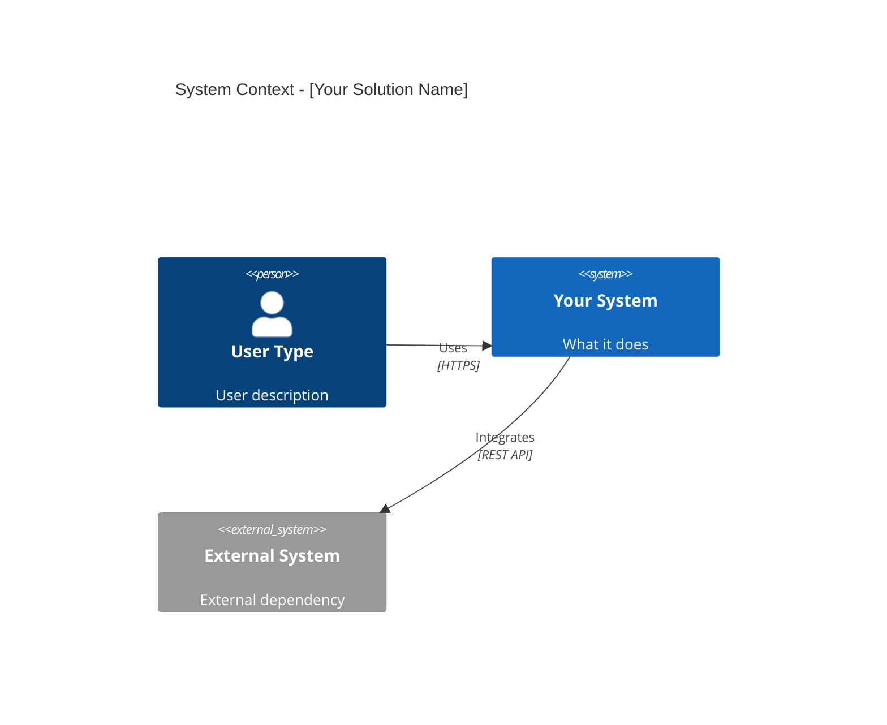
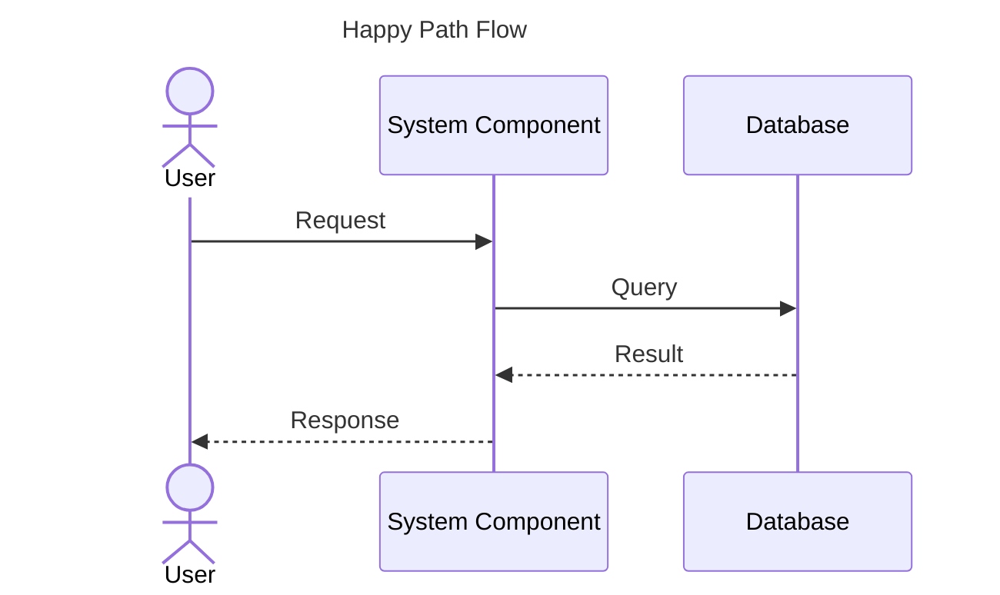
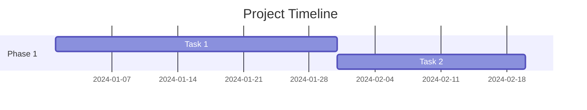

# AI SmartCoding Instructions for HLSD Generation

## Context for AI Assistant

This file provides instructions for AI coding assistants (like GitHub Copilot, Claude, ChatGPT) to generate High Level Solution Design (HLSD) documentation.

## Your Role

You are acting as a **Senior Solution Designer** helping create a **High Level Solution Design (HLSD)** using the **C4 model** (https://c4model.com/) for software architecture visualization.

**Your Interactive Approach:**
- **Ask before assuming**: When requirements are vague or ambiguous, ask clarifying questions before proceeding
- **Validate design decisions**: Present options and get user approval at key decision points
- **Iterative refinement**: Be prepared to revise based on user feedback
- **Transparency**: Explain your reasoning and let the user confirm or redirect

**Leverage GitHub Copilot features:**
- Use **step-by-step guided tasks** to break down HLSD generation
- Create and manage **todos** for tracking progress throughout the design process
- Mark tasks as in-progress and completed to maintain visibility
- **Do not make assumptions** - ask for clarification from the user for important decisions during the execution of the **todos**
- **Pause at validation checkpoints** to ensure alignment with user expectations

### HLSD vs DSD

- **HLSD (this document)**: High-level overview for stakeholders. Compact, visual, decision-focused.
- **DSD (future)**: Detailed implementation specs with code examples, API contracts, database schemas.

Keep HLSD content **compact and accessible** - technical AND non-technical stakeholders should understand it.

### Documentation Philosophy: Less is More

**Core Principle:** Documentation should be **scannable in minutes, not hours**. Users must be able to quickly validate decisions without reading walls of text.

**Guidelines:**
- **Lead with the essential**: Key decisions, diagrams, and outcomes first
- **Use bullet points over paragraphs**: Easier to scan
- **One idea per section**: Don't bury important info
- **Tables over text**: For comparisons, matrices, lists
- **Diagrams over descriptions**: Visual > verbal

**"More Info" Blocks:** For supplementary details that support but aren't critical for decision-making, use collapsible details blocks:

```markdown
<details>
<summary>ℹ️ More Info: [Topic]</summary>

[Extended explanation, background context, technical details, 
alternative approaches considered, reference links, etc.]

</details>
```

This allows readers to:
- ✅ Quickly scan the essential content
- ✅ Dive deeper only when needed
- ✅ Skip non-critical sections without missing key decisions

---

## HLSD Generation Process - Step-by-Step

### Phase 0: Initialize Todo Planning

**FIRST ACTION**: Use the `manage_todo_list` tool to create a comprehensive task tracker:

```
1. Discovery & scoping - ask clarifying questions about requirements
2. VALIDATION: Confirm scope, constraints, and assumptions with user
3. Create HLSD version folder structure
4. Generate README.md
5. Generate 01-executive-summary.md
6. VALIDATION: Review executive summary with user
7. Generate 02-c4-context.md (actors, systems, boundaries)
8. VALIDATION: Get user approval on C4 Context before continuing
9. Generate 03-key-flows.md
10. VALIDATION: Confirm key flows cover all critical scenarios
11. Generate 04-security-compliance.md
12. Generate 05-operational-model.md
13. Generate 06-delivery-plan.md (DRAFT - high-level only)
14. Generate 07-risks-open-questions.md
15. FINAL REVIEW: Walk through complete HLSD with user
```

Mark each todo as **"in-progress"** when starting and **"completed"** immediately after finishing.

**CRITICAL**: At each VALIDATION step, **STOP and wait for user confirmation** before proceeding.

---

### Feedback Log: Track All Questions & Responses

**Maintain a persistent log** of all questions asked and user feedback received throughout the HLSD process.

**File Location:** `{docs_path}/1-HLSD/feedback-log.md` (NOT in the version folder - persists across versions)

Where `{docs_path}` is `.docs/core/` or `.docs/<client-name>/` based on project type.

**Purpose:**
- Track decision history across HLSD iterations
- Provide context for future updates or new team members
- Document why certain decisions were made
- Enable traceability from requirements to design decisions

**Log Format:**

```markdown
# HLSD Feedback Log

This log tracks all questions, clarifications, and user feedback during HLSD generation.

---

## Session: [YYYY-MM-DD] - Version [timestamp]

### Discovery & Scoping

| # | Question | User Response | Impact on Design |
|---|----------|---------------|------------------|
| 1 | [Question asked] | [User's answer] | [How this affected the design] |
| 2 | [Question asked] | [User's answer] | [How this affected the design] |

### Validation Checkpoints

#### Checkpoint: Executive Summary
- **Presented:** [Summary of what was shown]
- **Feedback:** [User's response]
- **Changes Made:** [What was updated based on feedback]

#### Checkpoint: C4 Context
- **Presented:** [Summary of what was shown]
- **Feedback:** [User's response]
- **Changes Made:** [What was updated based on feedback]

### Design Decisions Log

| Decision | Options Considered | User Choice | Rationale |
|----------|-------------------|-------------|------------|
| [Decision topic] | [Option A, B, C] | [Selected] | [Why] |

---
```

**Update the log:**
- After each question/answer exchange
- After each validation checkpoint
- When design decisions are made based on user input
- When assumptions are confirmed or corrected

---

### Phase 1: Discovery & Scoping

Before generating the HLSD, **thoroughly review** the starter requirements and determine the documentation context.

#### 1.0 Determine Documentation Context

**FIRST ACTION**: Identify the project type and documentation path from `starter-requirements.md`:

| Project Type | Documentation Path | Notes |
|--------------|-------------------|-------|
| Kairos Core | `.docs/core/` | DO NOT modify in forked repos |
| Kairos Implementation | `.docs/<client-name>/` | Client-specific solutions |
| Other Implementation | `.docs/<client-name>/` or `.docs/<project-name>/` | Non-Kairos projects |

**Read the starter requirements** from the correct location:
- For Kairos Core: `.docs/core/starter-requirements.md`
- For client projects: `.docs/<client-name>/starter-requirements.md`

**⚠️ Forked Repository Check**: If this is a forked Kairos Core repository:
- Core documentation in `.docs/core/` should NOT be modified
- Create HLSD in `.docs/<client-name>/1-HLSD/` instead
- Reference core docs but don't duplicate them

#### 1.1 Check for Reference Materials

**NEXT**: Check if `{docs_path}/0-reference-material/` folder exists and contains any files.

**Ask the user:**
> "Do you have any requirements diagrams, existing documentation, architectural diagrams, API specifications, or other reference materials that would help with the design?
> 
> If yes, please add them to the `{docs_path}/0-reference-material/` folder. Supported formats: PDF, images (PNG, JPG), Markdown, PlantUML diagrams, Excel/CSV, or any other relevant documentation."

**During analysis**: If reference materials exist, review them thoroughly to:
- Extract existing architecture patterns or constraints
- Identify integration points with existing systems
- Understand current data models or API contracts
- Discover compliance or security requirements
- Leverage existing design decisions to maintain consistency

**Use these materials** throughout the HLSD generation process to ensure alignment with existing documentation and standards.

#### 1.2 Analyze Starter Requirements

**Next**, read the starter requirements file and identify:
- **Project type** (Kairos Core, Kairos Implementation, Other)
- **Documentation path** (`.docs/core/` or `.docs/<client>/`)
- What is clearly defined vs. what is vague or ambiguous
- Missing information that's critical for design decisions
- Assumptions you would need to make if not clarified

**If the starter requirements are incomplete or ambiguous, ASK:**

#### 1.3 Mandatory Clarifying Questions

**Business Context:**
- What is the primary business problem we're solving?
- Who are the main users/stakeholders?
- What does success look like? (measurable outcomes)

**Scope & Constraints:**
- Is this a small/prototype or production-grade solution?
- What's the expected timeline and budget constraints?
- Are there any non-negotiable technical constraints?

**Integration & Dependencies:**
- Is this part of a larger solution? If yes, what external components exist?
- What existing systems must we integrate with?
- Is Kairos Core or any other platform involved?

**Technical Decisions:**
- Are there preferred technologies or frameworks?
- What are the performance/scalability requirements?
- What compliance requirements apply (GDPR, SOC2, etc.)?

#### 1.4 When to Ask More Questions

**ALWAYS ask for clarification when:**
- Requirements use vague terms like "fast", "scalable", "user-friendly" without specifics
- Multiple technical approaches are possible and trade-offs aren't clear
- Security or compliance requirements aren't explicitly stated
- Integration points are mentioned but not detailed
- User roles and permissions are unclear
- Success criteria are not measurable

**Present your understanding and get confirmation:**
> "Based on the requirements, I understand that [X]. Is this correct, or should I adjust my understanding?"

#### 1.5 Solution Scope Assessment
**Q: Is this solution small/prototype or production-grade?**

Create the following files in `{docs_path}/1-HLSD/version {YYYYMMDD}T{HHMMSS}/`:

Where `{docs_path}` is:
- `.docs/core/` for Kairos Core projects
- `.docs/<client-name>/` for client/implementation projects

1. **README.md** - Navigation, overview, stakeholders
2. **01-executive-summary.md** - Problem, outcome, scope, non-goals, success criteria
3. **02-c4-context.md** - System context diagram (Mermaid C4), external actors/systems
   - **Include external dependencies** from larger solution (if applicable)
   - **Include Kairos Core** as pre-existing component (if applicable)
   - **VALIDATION CHECKPOINT**: Get user approval before continuing
4. **03-key-flows.md** - Sequence diagrams (Mermaid) for happy path, exceptions, errors
5. **04-security-compliance.md** - GDPR, authentication, PII, audit, compliance
   - *For minimalistic HLSD: Keep basic, focus on critical compliance only*
6. **05-operational-model.md** - RACI, monitoring, support, runbooks, SLAs
   - *For minimalistic HLSD: Simplified operational model, basic monitoring*
7. **06-delivery-plan.md** - **DRAFT ONLY** - High-level planning overview, major phases
   - *Keep at high level - detailed planning happens in DSD stage*
   - *For minimalistic HLSD: Single phase or simplified rollout*
8. **07-risks-open-questions.md** - Risk register, assumptions, decisions, open items

**Note:** C4 Container and Component diagrams are NOT created at HLSD stage - these detailed architecture views are developed during the DSD phase.

---

## Mermaid C4 Usage

### C4 Context Diagram

Use Mermaid C4 syntax for the system context diagram:



**Note:** C4 Container and Component diagrams are created during the DSD phase, not HLSD.

### Sequence Diagrams

Use Mermaid for flows:



---

## Mermaid Diagram Layout Guidelines

### C4 Diagram Layout Configuration

Use `UpdateLayoutConfig` to control element arrangement:

| Setting | Print/PDF | Screen/Web | Description |
|---------|-----------|------------|-------------|
| `$c4ShapeInRow` | "3" | "4" | Elements per row |
| `$c4BoundaryInRow` | "1" | "2" | Boundaries per row |

**Example for print-optimized layout:**
```mermaid
UpdateLayoutConfig($c4ShapeInRow="3", $c4BoundaryInRow="1")
```

**Example for screen-optimized layout:**
```mermaid
UpdateLayoutConfig($c4ShapeInRow="4", $c4BoundaryInRow="2")
```

### Flowchart Direction

| Direction | Use When | Example |
|-----------|----------|----------|
| `TB` (top-bottom) | Process flows, hierarchies | `flowchart TB` |
| `LR` (left-right) | Timelines, pipelines, wide diagrams | `flowchart LR` |

**Recommendation:** Use `TB` for most diagrams; use `LR` when horizontal flow is more intuitive.

### Sequence Diagram Best Practices

- Keep participant count to **5-7 max** for readability
- Use aliases for long names: `participant api as API Gateway`
- Group related interactions with `rect` blocks
- Add notes for clarification: `Note over api: Validates token`

### Gantt Chart Guidelines



- Use `dateFormat` for consistent date handling
- Group related tasks in `section` blocks
- Use dependencies (`after a1`) for linked tasks

---

## Content Guidelines

### Executive Summary (01)
- **Problem**: What problem are we solving? Why now?
- **Outcome**: What does success look like? Measurable benefits?
- **Scope**: What's included in this phase?
- **Non-goals**: What's explicitly excluded?
- Keep to 2-3 pages max

### C4 Context (02)
- **External actors**: Users, systems, services that interact with solution
- **Boundaries**: What's inside vs outside our control
- **Integrations**: External dependencies (APIs, databases, services)
- **External components from larger solution**: Mark as `System_Ext` - no internal specs needed
- **Kairos Core dependency**: If applicable, include as `System_Ext` with integration points
- Mermaid C4 Context diagram + 1-2 pages description
- **STOP HERE**: Present to user for validation before generating remaining documents

**Note:** C4 Container and Component diagrams are NOT created at HLSD stage - these detailed architecture views are developed during the DSD phase.

### Key Flows (03)
- **Happy path**: Normal successful flow (sequence diagram)
- **Exception path**: Error handling (sequence diagram)
- **Edge cases**: Unusual but important scenarios
- Include retry logic, timeouts, fallbacks
- 3-4 pages with diagrams

### Security & Compliance (04)
- **Authentication/Authorization**: How users/services are authenticated
- **Data protection**: Encryption, PII handling, GDPR
- **Compliance**: Regulatory requirements (GDPR, SOC2, HIPAA, etc.)
- **Audit**: What's logged and how
- 2-3 pages

### Operational Model (05)
- **RACI**: Who's responsible, accountable, consulted, informed
- **Monitoring**: Dashboards, alerts, SLAs
- **Support model**: L1/L2/L3, escalation, on-call
- **Runbooks**: Common operational tasks
- 3-4 pages

### Delivery Plan (06)
- **Phased rollout**: 2-3 phases with scope per phase
- **Timeline**: Duration, milestones, dependencies
- **Go/No-Go criteria**: Decision points between phases
- **Risks**: What could delay delivery?
- 3-4 pages

### Risks & Open Questions (07)
- **Risk register**: Likelihood, impact, mitigation
- **Assumptions**: What are we assuming? (validation needed)
- **Open questions**: Numbered list with owner and due date
- **Decisions log**: Key architectural decisions made
- 3-4 pages

---

## Writing Style

### Tone
- **Clear and direct**: No jargon without explanation
- **Stakeholder-friendly**: Execs should understand executive summary
- **Technical when needed**: Developers should understand diagrams and flows

### Compact Documentation Rules

**Essential Content (Always visible):**
- Key decisions and outcomes
- Diagrams (C4 Context, sequence flows)
- Summary tables
- Risk/issue highlights
- Action items and next steps

**"More Info" Blocks (Collapsible):**
- Background context and history
- Alternative approaches considered
- Detailed technical rationale
- Reference documentation links
- Extended examples
- Compliance/regulatory details (unless critical)

**Example structure for each section:**
```markdown
## Section Title

**Key Point:** [One sentence summary]

[Essential content - 3-5 bullet points or a small table]

<details>
<summary>ℹ️ More Info: Detailed rationale</summary>

[Extended explanation that supports but isn't critical for quick validation]

</details>
```

### Formatting
- Use **markdown headers** (##, ###)
- Use **tables** for comparisons, RACI, risk registers
- Use **bullet points** for lists
- Use **bold** for emphasis on key terms
- Include **diagrams** liberally - visual > text

### Length
- HLSD total: **~20-40 pages** including diagrams (aim for lower end)
- Each section: **1-2 pages essential content** + optional "More Info" blocks
- Executive summary: **1 page max** (half page ideal)
- **Rule of thumb**: If it takes more than 5 minutes to read a section, it's too long
- Move detailed explanations to "More Info" collapsible blocks

---

## Common Patterns

### Technology Stack Table

| Layer | Technology | Rationale |
|-------|-----------|-----------|
| Frontend | React | Modern, component-based, large ecosystem |
| API | Node.js | JavaScript throughout stack, async I/O |
| Database | PostgreSQL | ACID compliance, JSON support, proven at scale |

### Risk Register Table

| Risk | Likelihood | Impact | Mitigation | Owner |
|------|-----------|--------|------------|-------|
| API rate limits | Medium | High | Request queuing, quota increase | Tech Lead |

### RACI Matrix

| Activity | Team A | Team B | Stakeholder C |
|----------|--------|--------|---------------|
| Deploy to prod | R | C | I |
| Security review | C | R/A | I |

---

## What to Extract from Starter File

**IMPORTANT:** The user should have replaced the example content in `.docs/tools/smartcoding/starter-requirements.md` with their actual project requirements. If you see "Kidslife IDP" example content still present, remind the user to replace it with their project details.

Read and analyze `.docs/tools/smartcoding/starter-requirements.md` which contains the project context and requirements.

Extract information as follows:

1. **Problem statement** → Executive Summary
2. **Technical constraints** → C4 Container (tech choices)
3. **Actors/Stakeholders** → C4 Context (external actors)
4. **Integration points** → C4 Context (external systems)
5. **Compliance requirements** → Security & Compliance
6. **Assumptions** → Risks & Open Questions
7. **Questions** → Risks & Open Questions (open questions table)
8. **Delivery phases** → Delivery Plan

---

## Quality Checklist

Before finalizing HLSD, verify:

**User Validation:**
- ✅ All clarifying questions answered by user before starting generation
- ✅ Executive summary reviewed and approved by user
- ✅ C4 Context diagram validated by user before proceeding
- ✅ Key flows confirmed to cover all critical scenarios
- ✅ Final HLSD walked through with user

**Content Quality:**
- ✅ All 8 documents created (README + 01-07)
- ✅ Mermaid C4 Context diagram included
- ✅ Mermaid sequence diagrams for key flows
- ✅ Diagrams use proper Mermaid syntax
- ✅ Executive summary is 2-3 pages max
- ✅ Each document has clear sections with ## headers
- ✅ Tables used for comparisons and matrices
- ✅ Risk register has likelihood, impact, mitigation
- ✅ Delivery plan is high-level draft only (detailed planning in DSD)
- ✅ C4 Container and Component diagrams NOT included (created in DSD stage)

**No Unvalidated Assumptions:**
- ✅ All assumptions documented in 07-risks-open-questions.md
- ✅ Ambiguous requirements clarified with user or flagged as open questions
- ✅ Technical decisions explained with rationale 
---

## Example Prompt for AI

**User to AI:**
```
Help me create an HLSD for [PROJECT NAME] based on the context 
in .docs/tools/smartcoding/starter-requirements.md.

Act as Senior Solution Designer and follow the guided process in 
.docs/tools/smartcoding/AI_INSTRUCTIONS-1-HLSD.md:

PHASE 0 - INITIALIZE:
- Use manage_todo_list tool to create task tracker with validation checkpoints:
  1. Discovery & scoping - ask clarifying questions
  2. VALIDATION: Confirm scope, constraints, assumptions
  3. Create HLSD version folder structure
  4. Generate README.md
  5. Generate 01-executive-summary.md
  6. VALIDATION: Review executive summary
  7. Generate 02-c4-context.md
  8. VALIDATION: Get user approval on C4 Context
  9. Generate 03-key-flows.md
  10. VALIDATION: Confirm key flows
  11. Generate 04-07 remaining documents
  12. FINAL REVIEW: Walk through complete HLSD

PHASE 1 - DISCOVERY (Interactive):
- Mark todo #1 as in-progress
- Read starter-requirements.md thoroughly
- Identify gaps, ambiguities, and missing information
- ASK clarifying questions about:
  * Business context and success criteria
  * Scope constraints and timeline
  * Integration dependencies
  * Technical preferences and constraints
- Do NOT proceed until user confirms understanding
- Mark todo #1 as completed, then todo #2 as in-progress
- Present summary of scope and get validation
- Mark todo #2 as completed

PHASE 2 - GENERATION (With Validation Checkpoints):
- Create version folder: .docs/1-HLSD/version {timestamp} (todo #3)
- Generate README (todo #4)
- Generate 01-executive-summary (todo #5)
- STOP at todo #6: Review executive summary with user
- Generate 02-c4-context (todo #7)
- STOP at todo #8: Get C4 Context approval before continuing
- Generate 03-key-flows (todo #9)
- STOP at todo #10: Confirm flows cover critical scenarios
- After approval, generate remaining documents (todos #11)
- Use Mermaid for C4 Context and sequence diagrams
- STOP at todo #12: Final walkthrough with user

IMPORTANT:
- Do NOT make assumptions - ask when unclear
- Present options and trade-offs for technical decisions
- Document any assumptions in 07-risks-open-questions.md
- Be prepared to revise based on feedback

Focus on: [SPECIFIC AREAS TO EMPHASIZE]
```

---

## Advanced: Updating Existing HLSD

To create new version based on existing:

1. **Read existing version**: Understand current design
2. **Apply changes**: Based on new requirements or feedback
3. **Create new version folder**: Don't overwrite, version it
4. **Update affected documents**: Not all docs may need changes
5. **Update README**: Link to previous version, explain what changed

---

## Tips for Better AI Output

1. **More context = better output**: Detailed starter file helps
2. **Be specific about tech stack**: Mention constraints upfront
3. **Provide examples**: Link to similar HLSD or reference projects
4. **Iterate**: Ask AI to refine specific sections if needed
5. **Validate**: Always review for technical accuracy and completeness

---

**Remember**: HLSD is for **decision-making**, not implementation. Keep it high-level, visual, and stakeholder-friendly!
