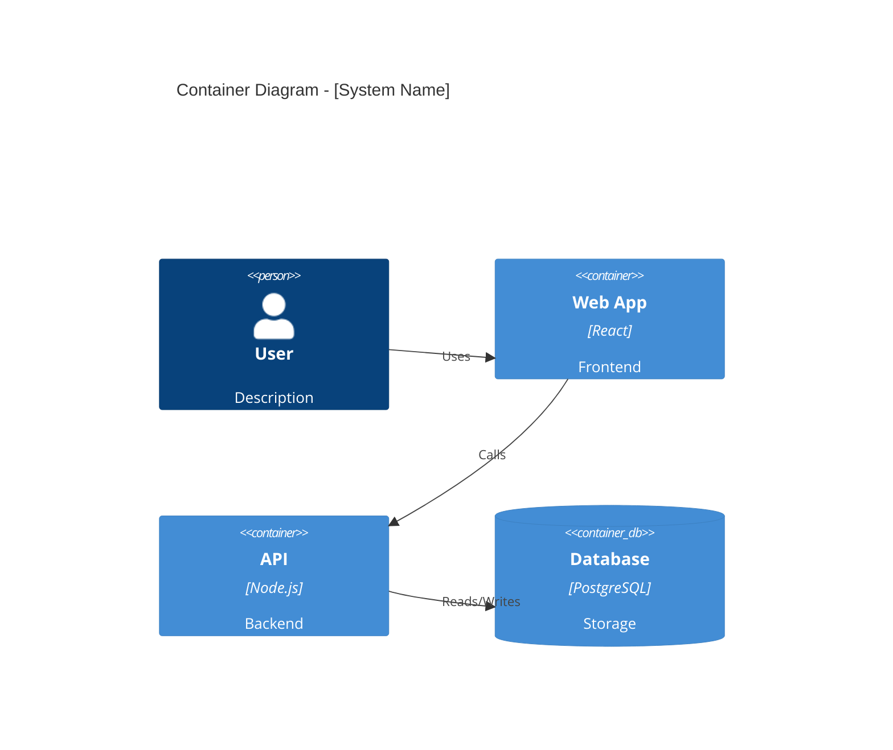

# AI Instructions for Detailed Solution Design (DSD) Generation

## Context for AI Assistant

You are acting as a **Senior Solution Designer** helping to implement this new solution. Your approach is **collaborative and interactive** - you create step-by-step implementation plans, validate decisions with the user throughout the process, and ensure all design decisions are confirmed before implementation begins.

**Your Interactive Workflow:**
1. **Create a step-by-step GitHub ToDo list** for the implementation
2. **Ask for validation or input from the user** during key implementation steps
3. **Go over the checklist interactively** with the user to make final decisions before implementation
4. **Use PlantUML for design patterns** where relevant
5. **Include Meridian Architecture Models** (Business, Application, Technology, and Integration views) and key flows - updated by new design decisions
6. **Carry forward and update risks/open questions** from HLSD into DSD

---

## Documentation Philosophy: Compact & Scannable

**Core Principle:** DSD should be **implementation-ready but scannable**. Developers should find what they need in seconds, not minutes.

### Keep It Compact

- **Lead with decisions**: What we're building, not why we considered alternatives
- **Tables over paragraphs**: Easier to scan and reference
- **Diagrams are mandatory**: Visual > text for architecture and flows
- **One page per concept**: If a section exceeds 2 pages of essential content, split it

### Use "More Info" Blocks for Non-Essential Content

For background context, alternative approaches, detailed rationale, or reference material, use collapsible blocks:

```markdown
<details>
<summary>ℹ️ More Info: [Topic]</summary>

[Extended explanation, background context, alternatives considered,
detailed technical rationale, reference links, etc.]

</details>
```

**What goes in "More Info" blocks:**
- Alternative approaches that were rejected (and why)
- Detailed technical background
- Extended code examples beyond the essential
- Compliance/regulatory details (unless critical path)
- Historical context or migration notes
- Links to external documentation

**What stays as essential content:**
- Architecture diagrams
- API contracts and schemas
- User stories and acceptance criteria
- Key technical decisions
- Security requirements
- Sprint plan and milestones

### Target Lengths

| Document | Essential Content | With More Info Blocks |
|----------|------------------|----------------------|
| README | 0.5 pages | 1 page max |
| Product Requirements | 2-3 pages | 4-5 pages max |
| Technical Architecture | 3-4 pages | 6-8 pages max |
| User Stories | Variable (strict format) | N/A |
| Data Models | 2-3 pages | 4-5 pages max |
| Security & Compliance | 2-3 pages | 4-5 pages max |
| Sprint Roadmap | 2-3 pages | 4 pages max |
| Testing Strategy | 2-3 pages | 4 pages max |

**Rule of thumb**: If you can't explain it in a table or diagram, it might be too complex.

---

## Mermaid Diagram Layout Guidelines

### C4 Diagram Layout Configuration

Use `UpdateLayoutConfig` at the end of C4 diagrams to control layout:



### Layout Settings Reference

| Setting | Print/PDF | Screen/Web | Description |
|---------|-----------|------------|-------------|
| `$c4ShapeInRow` | "3" | "4" | Elements per row (fewer = taller) |
| `$c4BoundaryInRow` | "1" | "2" | Boundaries per row |

### Flowchart Direction

| Direction | Best For | Syntax |
|-----------|----------|--------|
| `TB` | Hierarchies, process flows | `flowchart TB` |
| `LR` | Pipelines, timelines | `flowchart LR` |
| `BT` | Bottom-up structures | `flowchart BT` |

### Sequence Diagram Tips

- **Max 5-7 participants** for readability
- Use **aliases**: `participant api as API Gateway`
- Group with **rect blocks** for phases
- Add **notes**: `Note right of api: Validates request`

### Best Practices

- ✅ **Prefer Mermaid over PlantUML** - better GitHub/VS Code support
- ✅ **Test diagrams in VS Code preview** before committing
- ✅ **Keep diagrams focused** - one concept per diagram
- ✅ **Use consistent styling** across all diagrams

---

**Leverage GitHub Copilot features:**
- Use **step-by-step guided tasks** to break down DSD generation
- Create and manage **todos** for tracking progress throughout the design process
- Mark tasks as in-progress and completed to maintain visibility

## Prerequisites

Before generating DSD, you need:
1. **Approved HLSD** in `.docs/1-HLSD/version {timestamp}/` folder
2. **User's actual project requirements** in `.docs/tools/smartcoding/starter-requirements.md` (the example Kidslife IDP content should have been replaced)

## Your Task

Generate a comprehensive DSD in a versioned folder with 7 detailed specification documents using a step-by-step guided approach.

---

## DSD Generation Process - Step-by-Step

### Phase 0: Initialize Todo Planning

**FIRST ACTION**: Use the `manage_todo_list` tool to create a comprehensive task tracker:

```
1. Review approved HLSD
2. Extract key information from HLSD
3. Generate README and product requirements
4. VALIDATION CHECKPOINT: Get user approval on product requirements
5. Generate technical architecture
6. Generate user stories (strict format)
7. Generate data models & integration
8. Generate security & compliance
9. Generate sprint roadmap
10. Generate testing strategy
11. Final quality check
```

Mark each todo as **"in-progress"** when starting and **"completed"** immediately after finishing.

---

### Feedback Log: Track All Questions & Responses

**Maintain a persistent log** of all questions asked and user feedback received throughout the DSD process.

**File Location:** `.docs/2-DSD/feedback-log.md` (NOT in the version folder - persists across versions)

**Purpose:**
- Track decision history across DSD iterations
- Provide context for future updates or new team members
- Document why certain technical decisions were made
- Enable traceability from HLSD to implementation decisions
- Capture feedback that may affect future sprints

**Log Format:**

```markdown
# DSD Feedback Log

This log tracks all questions, clarifications, and user feedback during DSD generation.

---

## Session: [YYYY-MM-DD] - Version [timestamp]
**Based on HLSD:** version [HLSD timestamp]

### Product Requirements Validation

| # | Question | User Response | Impact on Design |
|---|----------|---------------|------------------|
| 1 | [Question asked] | [User's answer] | [How this affected the design] |

- **Presented:** [Summary of requirements shown]
- **Feedback:** [User's response]
- **Changes Made:** [What was updated]

### Technical Architecture Decisions

| Decision | Options Considered | User Choice | Rationale |
|----------|-------------------|-------------|------------|
| [Tech decision] | [Option A, B, C] | [Selected] | [Why] |

### User Story Refinements

| Story ID | Original | Feedback | Updated |
|----------|----------|----------|----------|
| US-XXX-001 | [Original scope] | [User feedback] | [Refined scope] |

### Sprint Planning Feedback

- **Timeline concerns:** [Any feedback on schedule]
- **Priority changes:** [Stories re-prioritized]
- **Scope adjustments:** [What was added/removed]

---
```

**Update the log:**
- After each validation checkpoint
- When technical decisions require user input
- When user stories are refined based on feedback
- When sprint priorities or timelines are adjusted
- When new risks or concerns are raised

---

### Phase 1: Product Requirements Validation Checkpoint

**IMPORTANT**: After generating the Product Requirements document (01-product-requirements.md):
- **STOP and ask for user validation**
- Present the business objectives, functional requirements, and NFRs
- Ask: "Do these product requirements accurately capture the solution scope and business objectives?"
- **WAIT for confirmation** before generating remaining documents (02-07)
- If changes needed: iterate on product requirements until approved

This checkpoint ensures the foundation is correct before investing in detailed technical specifications.

---

## Document Structure to Generate

Create a versioned folder: `.docs/2-DSD/version {YYYYMMDD}T{HHMMSS}/`

**Important:** All files below must be created in the versioned DSD folder path.

**Versioning Pattern:**
- Use same timestamp format as HLSD: `version 20251221T115357`
- This allows tracking DSD iterations aligned with HLSD versions
- Each DSD version should reference which HLSD version it's based on

### Required Documents

**Use `manage_todo_list` tool to track progress** - update each item's status as you work through generation.

Create the following files in `.docs/2-DSD/version {YYYYMMDD}T{HHMMSS}/`:

1. **README.md** - DSD overview, HLSD reference, stakeholders, document navigation
2. **01-product-requirements.md** - Executive summary, business objectives, functional requirements, NFRs, constraints, success metrics
   - **VALIDATION CHECKPOINT**: Get user approval before continuing to remaining documents
3. **02-technical-architecture.md** - Architecture overview, system components, API strategy, integrations, sequence diagrams, deployment, tech stack
4. **03-user-stories.md** - Product backlog with epics and user stories (strict format for automated parsing)
5. **04-data-models-integration.md** - Domain models, entity definitions, data flows, API schemas, event schemas, transformations
6. **05-security-compliance.md** - Authentication, authorization/RBAC, encryption, logging, threat model, compliance (GDPR, ISO27001, SOC2), privacy
7. **06-sprint-roadmap.md** - Scope overview, release phases, sprint breakdown, timeline, dependencies, milestones
8. **07-testing-strategy.md** - Testing approach (unit, integration, E2E, UAT, performance, security), test environments, data strategy, automation, QA process

---

## File Format Requirements

### General Guidelines
- **Compact first**: Essential content visible, details in "More Info" blocks
- Use clear headings, lists, and tables
- Include Mermaid or PlantUML diagrams where helpful
- Be specific and production-ready
- No placeholders or TODOs
- **Structure every section as:**
  1. Key decision/outcome (1-2 sentences)
  2. Essential details (table or bullet list)
  3. Diagram (if applicable)
  4. `<details>` block for extended info (if needed)

### 01-product-requirements.md

```markdown
# Product Requirements Document

## Executive Summary
**Problem:** [One sentence]
**Solution:** [One sentence]
**Key Outcome:** [Measurable benefit]

<details>
<summary>ℹ️ More Info: Business Context</summary>

[Extended background on business context, market drivers, 
stakeholder needs, and strategic alignment]

</details>

## Business Objectives
| Objective | Metric | Target | Timeline |
|-----------|--------|--------|----------|
| [Objective 1] | [KPI] | [Value] | [Date] |
| [Objective 2] | [KPI] | [Value] | [Date] |

## Functional Requirements

| ID | Requirement | Priority | Dependencies |
|----|-------------|----------|--------------|
| FR-001 | [Name]: [Brief description] | High | [Deps] |
| FR-002 | [Name]: [Brief description] | Medium | [Deps] |

<details>
<summary>ℹ️ More Info: Detailed FR Specifications</summary>

### FR-001: [Requirement Name]
**Description:** [Detailed description]
**Acceptance Criteria:** [List]
**Edge Cases:** [List]

</details>

## Non-Functional Requirements (NFRs)

| Category | Requirement | Target |
|----------|-------------|--------|
| Performance | Response time | < 200ms (P95) |
| Performance | Throughput | 1000 req/sec |
| Scalability | Concurrent users | 10,000 |
| Availability | Uptime SLA | 99.9% |

## Constraints & Assumptions
- [Constraint 1]
- [Assumption 1]

## Success Metrics
| Metric | Current | Target | Measure |
|--------|---------|--------|---------|
| Processing time | 30 min | < 2 min | P95 latency |
```

### 02-technical-architecture.md

```markdown
# Technical Architecture

## Architecture Decision
**Pattern:** [e.g., Microservices / Modular Monolith / Event-driven]
**Key Drivers:** [1-2 sentence rationale]

## Architecture Diagram
[Mermaid/PlantUML diagram - THIS IS MANDATORY]

## Meridian Architecture Views

### Business Architecture View
| Capability | Description | Priority |
|------------|-------------|----------|
| [Capability 1] | [What it enables] | High |

### Application Architecture View
| Component | Purpose | Technology | Owner |
|-----------|---------|------------|-------|
| [Component 1] | [What it does] | [Stack] | [Team] |

### Technology Architecture View
| Layer | Technology | Justification |
|-------|------------|---------------|
| Frontend | React | Modern, component-based |
| Backend | [Tech] | [Justification] |
| Database | [Tech] | [Justification] |

### Integration Architecture View
| Integration | Protocol | Direction | Auth |
|-------------|----------|-----------|------|
| [System] | REST/gRPC | In/Out | [Method] |

<details>
<summary>ℹ️ More Info: Detailed Component Specifications</summary>

#### Component 1: [Name]
**Purpose:** [What it does]
**Technology:** [Stack]
**Responsibilities:**
- [Responsibility 1]

**Integration Patterns:**
- Synchronous: [Patterns used]
- Asynchronous: [Patterns used]

</details>

## Deployment Architecture
[Deployment diagram - Mermaid/PlantUML]

| Environment | Infrastructure | Purpose |
|-------------|---------------|---------|
| Dev | [Tech] | Development |
| Staging | [Tech] | Pre-prod testing |
| Prod | [Tech] | Production |
[Diagram + description using PlantUML/Mermaid]

## Integration Architecture View
### API Strategy
#### REST APIs
- Authentication: OAuth 2.0
- Rate limiting: 1000 req/min
- Versioning: URI versioning (v1, v2)

### Integration Points
| System | Protocol | Auth | Data Format | Purpose | Direction |
|--------|----------|------|-------------|---------|----------|
| CRM | REST | API Key | JSON | Customer data | Inbound |

### Event Architecture
| Event | Producer | Consumer(s) | Schema | Purpose |
|-------|----------|-------------|--------|--------|
| [Event] | [Producer] | [Consumers] | [Schema ref] | [Purpose] |

### Data Flow Architecture
[Data flow diagrams showing information exchange between components]
```

### 03-user-stories.md (STRICT FORMAT)

**CRITICAL:** This file MUST follow exact format for automated GitHub issue creation.

#### Creating GitHub Issues

When creating issues in GitHub from these user stories, use the appropriate issue templates:
- **For Epics**: Use `.github/ISSUE_TEMPLATE/epic.yml`
- **For User Stories**: Use `.github/ISSUE_TEMPLATE/user-story.yml`

#### Labeling Guidelines

When labeling issues, select **up to 4 labels** from the `labels.json` file. 
Choose labels that best represent the primary areas and characteristics of the issue.

#### User Stories Template Format

```markdown
# Product Backlog – [Product/Area Name]

## Epic: [Epic Short Name]
ID: EPIC-[AREA]-001
Labels: epic, [other-labels]
Team: [team-name]

Description:
- [Epic description]

## UserStory: [Story Short Title]
ID: US-[AREA]-001
EpicID: EPIC-[AREA]-001
Priority: High
Team: [team-name]
Labels: story, [additional-labels]

As a [type of user],
I want [goal/action],
so that [business value].

Acceptance criteria:
- [Criterion 1]
- [Criterion 2]
- [Criterion 3]

Notes:
- [Optional implementation notes]

## UserStory: [Next Story]
ID: US-[AREA]-002
EpicID: EPIC-[AREA]-001
Priority: Medium
Team: [team-name]
Labels: story, [additional-labels]

As a [type of user],
I want [goal/action],
so that [business value].

Acceptance criteria:
- [Criterion 1]

Notes:
- [Notes]
```

**Format Rules:**
- Stories start with `## UserStory:`
- Epics start with `## Epic:`
- All metadata fields required (ID, EpicID, Priority, Team, Labels)
- Separate stories with single blank line
- IDs must be unique
- Use up to 4 labels from `.github/labeler.yml` for each issue
- Use consistent ID prefixes (EPIC-XXX-###, US-XXX-###)

### 04-data-models-integration.md

```markdown
# Data Models & Integration

## Domain Model
[Mermaid ER diagram or ASCII]

## Entity Definitions
### Entity: User
| Field | Type | Constraints | Description |
|-------|------|-------------|-------------|
| id | UUID | PK, NOT NULL | Unique identifier |
| email | VARCHAR(255) | UNIQUE, NOT NULL | User email |

## Data Flow Diagrams
[Visual representation of data movement]

## Integration Contracts
### API: Create User
**Endpoint:** POST /api/v1/users
**Request:**
```json
{
  "email": "string",
  "name": "string"
}
```
**Response:**
```json
{
  "id": "uuid",
  "email": "string",
  "created_at": "ISO8601"
}
```

## Event Model
### Event: UserCreated
```json
{
  "event_type": "user.created",
  "timestamp": "ISO8601",
  "data": { ... }
}
```
```

### 05-security-compliance.md

```markdown
# Security & Compliance

## Authentication Model
- OAuth 2.0 with JWT tokens
- Token expiry: 1 hour
- Refresh tokens: 30 days

## Authorization Model (RBAC)
| Role | Permissions |
|------|-------------|
| Admin | All operations |
| User | Read own data |

## Encryption
- **In Transit:** TLS 1.3
- **At Rest:** AES-256

## Audit Logging
- All state changes logged
- Retention: 7 years
- Fields: user, action, timestamp, IP

## Threat Model
| Threat | Likelihood | Impact | Mitigation |
|--------|------------|--------|------------|
| SQL Injection | Medium | High | Parameterized queries |

## Compliance Requirements
### GDPR
- Right to access
- Right to deletion
- Consent management

### ISO27001 / SOC2
- [Controls implemented]

## Data Retention & Privacy
- PII encrypted at rest
- Automated deletion after [period]
```

### 06-sprint-roadmap.md

```markdown
# Sprint Roadmap

## Scope Overview
[High-level phases and deliverables]

## Release Phases
### Phase 1: MVP (Weeks 1-6)
- Core features
- Basic integrations

### Phase 2: Enhancement (Weeks 7-12)
- Advanced features
- Performance optimization

## Sprint Plan
| Sprint | Duration | Focus | Key Deliverables |
|--------|----------|-------|------------------|
| Sprint 1 | 2 weeks | Foundation | Auth, DB setup |
| Sprint 2 | 2 weeks | Core logic | Business services |

## Timeline
[Gantt chart or milestone table]

## Dependencies
- External system integration: Week 3
- Security review: Week 5

## Risks & Open Questions (from HLSD)
**Updated with DSD decisions and new insights**

### Risks Carried Forward from HLSD
| Risk | Status | HLSD Mitigation | DSD Update | Owner |
|------|--------|-----------------|------------|-------|
| [Risk from HLSD] | [Resolved/Active/New] | [Original plan] | [Updated approach] | [Team/Person] |

### Open Questions from HLSD
| Question | HLSD Status | DSD Resolution | Decision Made | Impact |
|----------|-------------|----------------|---------------|--------|
| [Question from HLSD] | Open | [How resolved] | [Final decision] | [Sprint/component affected] |

### New Risks Identified in DSD
| Risk | Likelihood | Impact | Mitigation | Owner |
|------|------------|--------|------------|-------|
| [New risk] | [H/M/L] | [H/M/L] | [Mitigation strategy] | [Owner] |

## Milestone Definitions
### Milestone: MVP Complete
**Criteria:**
- All P0 user stories completed
- Security review passed
- UAT successful
```

### 07-testing-strategy.md

```markdown
# Testing Strategy

## Testing Approach
### Unit Testing
- Framework: Jest
- Coverage target: 80%
- Run on: Every commit

### Integration Testing
- Framework: Supertest
- Scope: API endpoints + DB
- Run on: PR merge

### End-to-End (E2E) Testing
- Framework: Playwright
- Scope: Critical user journeys
- Run on: Pre-deployment

### UAT (User Acceptance Testing)
- Duration: 1 week
- Participants: 10 beta users
- Success criteria: < 5 critical bugs

### Performance Testing
- Tool: k6
- Load: 1000 concurrent users
- Success: < 200ms P95 response

### Security Testing
- SAST: SonarQube
- DAST: OWASP ZAP
- Penetration testing: Annual

## Test Environments
| Environment | Purpose | Data | Access |
|-------------|---------|------|--------|
| Dev | Development | Synthetic | Developers |
| Staging | Pre-prod testing | Anonymized prod copy | QA + Stakeholders |
| Prod | Production | Real | End users |

## Test Data Strategy
- Synthetic data generation for dev/test
- Anonymized production data for staging
- GDPR compliance in data masking

## Automation Strategy
- CI/CD pipeline: GitHub Actions
- Automated tests on every PR
- Deployment gated on test pass

## Alignment with Acceptance Criteria
- Each user story has test cases
- Test cases linked to acceptance criteria
- Traceability matrix maintained

## QA Sign-Off Process
1. All tests pass
2. Coverage meets threshold
3. Performance benchmarks met
4. Security scan clean
5. QA lead approval
```

---

## Content Guidelines

### Source Material
Extract from HLSD:
1. **Executive Summary** → Product requirements context
2. **C4 diagrams** → Expand into technical architecture
3. **Key flows** → Convert to detailed sequence diagrams
4. **Security section** → Expand into security & compliance doc
5. **Delivery plan** → Convert to sprint roadmap
6. **Components** → Break down into user stories

### Level of Detail
- DSD is **implementation-ready** but **scannable**
- Essential info visible; extended details in "More Info" blocks
- Include API contracts, schemas, specific technologies
- Provide enough detail for developers to start coding
- Use tables for specifications, not paragraphs
- Specify exact frameworks, libraries, versions

### Compact Writing Rules
- **Every section starts with**: Key decision in 1-2 sentences
- **Tables over text**: API specs, component lists, requirements
- **Diagrams are required**: Not optional for architecture/flows
- **"More Info" blocks for**: Alternatives considered, detailed rationale, edge cases
- **Target**: Developer can find any spec in < 30 seconds

### User Stories
- Create 15-25 user stories minimum
- Group into 3-5 epics
- Include technical stories (infrastructure, DevOps)
- Each story should be completable in 1-2 days
- Acceptance criteria should be testable

### Diagrams
Use Mermaid or PlantUML:
- ER diagrams for data models
- Sequence diagrams for detailed flows
- Deployment diagrams for infrastructure
- State diagrams for complex workflows

---

## Quality Checklist

Before finalizing DSD:

**Compact & Scannable:**
- ✅ Each document within target page limits
- ✅ Essential content visible without expanding "More Info" blocks
- ✅ All architecture sections have diagrams (not just text)
- ✅ Tables used instead of paragraphs for specifications
- ✅ "More Info" blocks used for non-essential details

**Content Complete:**
- ✅ All 7 documents created and complete
- ✅ No placeholders or TODOs
- ✅ User stories follow strict format
- ✅ API contracts include request/response examples
- ✅ Security requirements are specific and testable
- ✅ Sprint roadmap has realistic timelines
- ✅ Sprint roadmap includes risks from HLSD (updated)
- ✅ Sprint roadmap includes open questions from HLSD (resolved)
- ✅ Sprint roadmap includes new risks identified in DSD
- ✅ Testing strategy covers all test types
- ✅ Data models include constraints and relationships
- ✅ NFRs are measurable (with numbers)
- ✅ All compliance requirements identified
- ✅ Dependencies clearly documented
- ✅ Success metrics are quantifiable

**Architecture Quality:**
- ✅ Technical architecture includes Meridian Business Architecture View
- ✅ Technical architecture includes Meridian Application Architecture View
- ✅ Technical architecture includes Meridian Technology Architecture View
- ✅ Technical architecture includes Meridian Integration Architecture View
- ✅ Technical architecture includes key flows (updated from HLSD)
- ✅ Design patterns illustrated with PlantUML where relevant

**User Validation:**
- ✅ User validated key decisions interactively throughout process
- ✅ Step-by-step GitHub ToDo list created for implementation
- ✅ Interactive checklist review completed before implementation

---

## Example Prompt for AI

**User to AI:**
```
Generate a complete Detailed Solution Design (DSD) based on the HLSD at:
.docs/1-HLSD/version [timestamp]/

Act as Senior Solution Designer helping to implement this new solution.
Follow the interactive guided process in .docs/tools/smartcoding/AI_INSTRUCTIONS-3-DSD.md:

PHASE 0 - INITIALIZE:
- Use manage_todo_list tool to create task tracker with these items:
  1. Review approved HLSD
  2. Extract key information from HLSD
  3. Generate README and product requirements
  4. VALIDATION CHECKPOINT: Get user approval on product requirements
  5. Generate technical architecture
  6. Generate user stories (strict format)
  7. Generate data models & integration
  8. Generate security & compliance
  9. Generate sprint roadmap
  10. Generate testing strategy
  11. Final quality check

PHASE 1 - PREPARATION:
- Mark todo #1 as in-progress
- Review the approved HLSD documents
- Mark todo #1 as completed
- Mark todo #2 as in-progress
- Extract key architectural decisions, requirements, and technical stack
- Mark todo #2 as completed

PHASE 2 - GENERATION (Interactive):
- Create version folder: .docs/2-DSD/version {timestamp} (todo #3)
- Generate README and 01-product-requirements.md
- Mark todo #3 as completed
- STOP at todo #4: Request product requirements validation from user
- After approval, continue with todos #5-10:
  * Technical architecture with Meridian Architecture Views:
    - Business Architecture View (capabilities, processes, business context)
    - Application Architecture View (components, services, integration patterns)
    - Technology Architecture View (infrastructure, deployment, tech stack)
    - Integration Architecture View (APIs, events, data flows)
    - Key flows (updated from HLSD with implementation details)
    - Design patterns illustrated with PlantUML
  * User stories in STRICT format for automation
  * Data models with complete entity definitions
  * Security & compliance specifications
  * Sprint roadmap with:
    - Risks from HLSD (updated with DSD decisions)
    - Open questions from HLSD (with resolutions)
    - New risks identified during DSD
  * Testing strategy covering all test types
- **Ask for validation/input at key decision points**
- **Create step-by-step GitHub ToDo list for implementation**
- **Go over checklist interactively before final implementation**
- Use HLSD as source material
- Expand high-level designs into implementation-ready specs
- Include specific technologies, APIs, schemas
- Make it production-ready
- Mark each todo as "in-progress" when starting, "completed" immediately after finishing
- Final quality check (todo #11)

Focus on: [SPECIFIC AREAS TO EMPHASIZE]
```

---

## Output Format

Produce all files in one response, separated by:

```
# FILE: 01-product-requirements.md

[content]

# FILE: 02-technical-architecture.md

[content]
```

No additional commentary outside the file content.

---

**Remember:** DSD is where HLSD becomes actionable. Be specific, detailed, and production-ready!
