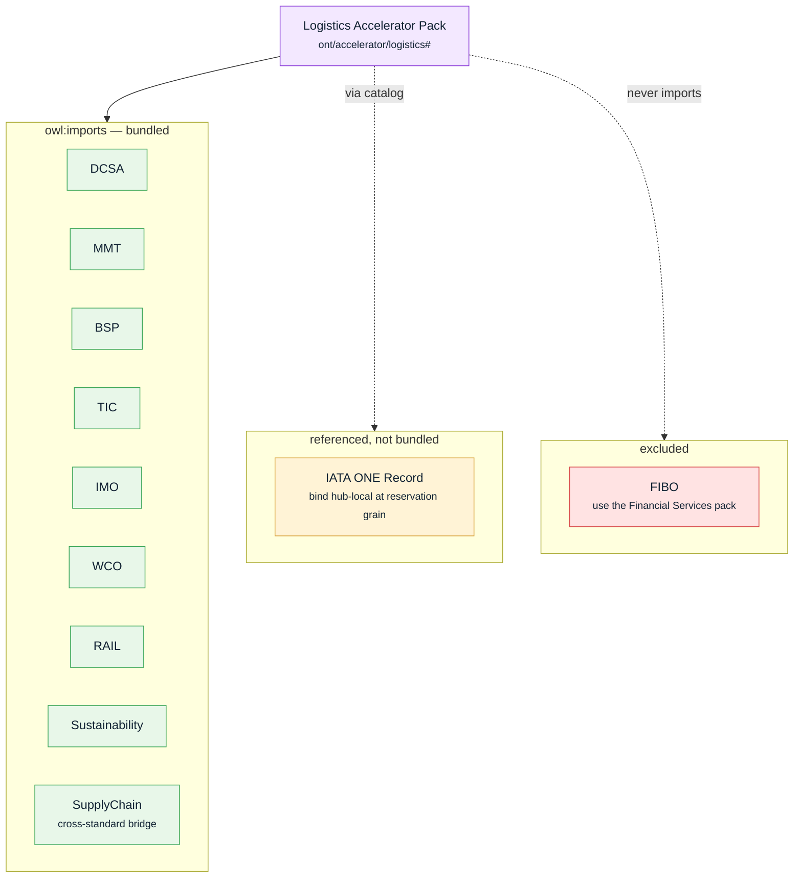
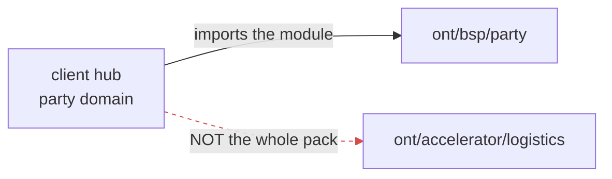

# Logistics accelerator pack

An accelerator pack is a **pre-composed bundle**. Instead of a client hub importing nine suites
one by one, it imports the pack and gets the whole vertical in a single `owl:imports`. The
Logistics pack bundles eight derived suites plus the SupplyChain bridge, references IATA ONE
Record without bulk-importing it, and deliberately excludes FIBO.

## Import the module, not the pack

The bundle exists for tools that need the complete graph at once (validation, projection). A
client hub's **domain** ontology should still import the specific module it needs — `…/ont/bsp/party`,
not the whole pack — so its real dependencies stay readable. See
[`CONTRACT.md`](../../CONTRACT.md) → "Rules for consumers".

## Target sectors

Freight forwarding · ocean carrier · road carrier · terminal operations · 3PL/LSP · NVOCC ·
customs brokerage. A second pack, **Financial Services**, bundles FIBO foundations + BSP for the
financial vertical.
