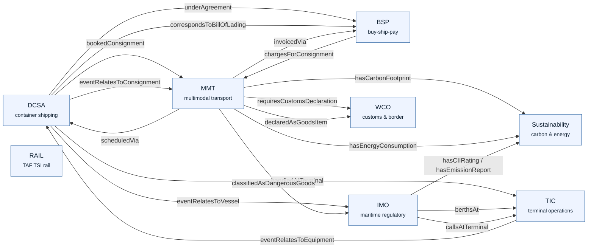

# How the domains relate

The nine derived suites are not islands. Eight of them model a slice of the logistics value
chain; the ninth — **SupplyChain** — owns no classes of its own. It is a pure *bridge module*: a
set of cross-standard object properties that link a class in one suite to a class in another. The
edges below are exactly those bridge properties (see the generated
[`supplychain.md`](../generated/supplychain.md) for the machine-rendered version).

Read this as the answer to "if I'm looking at a booking, how do I get to its customs declaration,
its emissions, or its terminal handling?"

> **RAIL** is bundled in the logistics pack for EU rail-freight reservation and running (TAF TSI),
> and binds at the reservation grain via the
> [multimodal-order-leg](patterns/multimodal-order-leg.md) pattern rather than through a
> SupplyChain bridge property today — so it stands apart in this view.

## The suites at a glance

| Suite | Standard | Focus |
|---|---|---|
| **DCSA** | DCSA API Standards | Container shipping lifecycle — booking, B/L, vessel, equipment, track & trace |
| **MMT** | UN/CEFACT MMT-RDM | Consignment, movement, cargo, equipment across modes |
| **BSP** | ISO 20197-1:2024 Buy-Ship-Pay | Party, contract, invoice, settlement |
| **TIC** | TIC 4.0 | Terminal operations, handling, automotive |
| **IMO** | IMO Compendium / FAL / IMDG | Vessel registry, dangerous goods, port-call, crew, security |
| **WCO** | WCO Data Model 3.x | Customs declarations, goods items, trade facilitation |
| **RAIL** | TAF TSI | EU rail path request, consignment order, train running, rolling stock |
| **Sustainability** | ISO 14083:2023 / GLEC | Emissions, energy, ESG reporting |
| **SupplyChain** | — (Kairos bridge) | Cross-standard properties that link all of the above |
