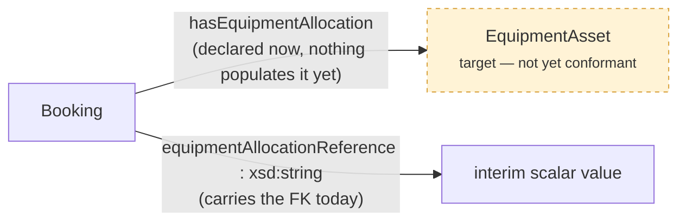
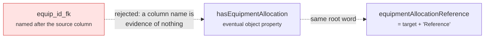

# Pattern: Deferred relationship

**Closes: naming drift when a link lands before its target conforms.** A slice needs to reference
a cross-domain key before the target class exists. Rather than block the slice or silently drop
the link, declare the eventual object property **now** and carry the foreign key on an interim
scalar whose name is mechanically derived from it.

## The naming rule (normative)

The interim scalar's name **must** be the eventual object property's target with `Reference`
appended — never a different root word. That pairing makes the eventual migration mechanical.

Once the target conforms, hubs populate `hasEquipmentAllocation` directly and retire the interim
scalar. **Silently dropping the relationship** because the target is unresolved is the data-loss
defect this pattern replaces.

Source: [`blueprints/patterns/deferred-relationship`](../../../blueprints/patterns/deferred-relationship/pattern.md).
