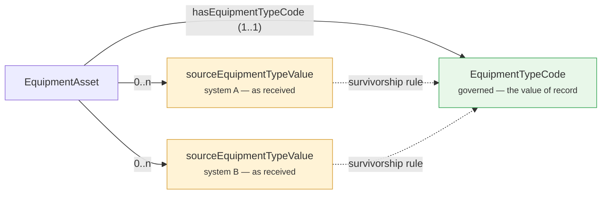
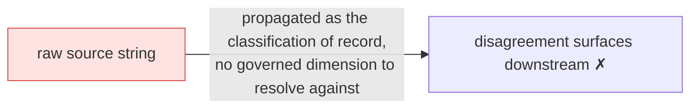

# Pattern: Governed code list

**Closes gap 8.** A classification dimension (equipment type, status, cargo category) arrives as a
raw source string. When two systems disagree on the code — or the same code means different things
— nothing resolves it and the conflict leaks downstream. This pattern splits the **governed,
cross-source code** from the **raw source value**, with an explicit survivorship rule.

The governed code is the **resolved** value (`1..1`); the source values are the `0..n` inputs that
were resolved. Which source wins is stated **per code-list**, never inferred from load order.

## The rejected shape

Naming is **normative**: `<Dimension>Code`, `source<Dimension>Value`, `has<Dimension>Code`. A
single-source, internally-consistent classification with no cross-source counterpart does not need
the split — a plain `sh:in (...)` string is simpler.

Source: [`blueprints/patterns/governed-code-list`](../../../blueprints/patterns/governed-code-list/pattern.md).
