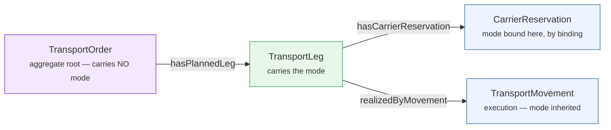
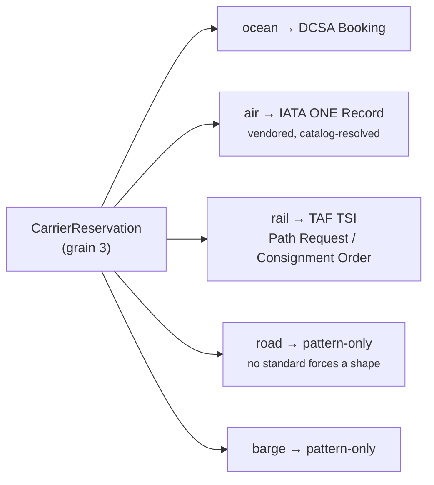
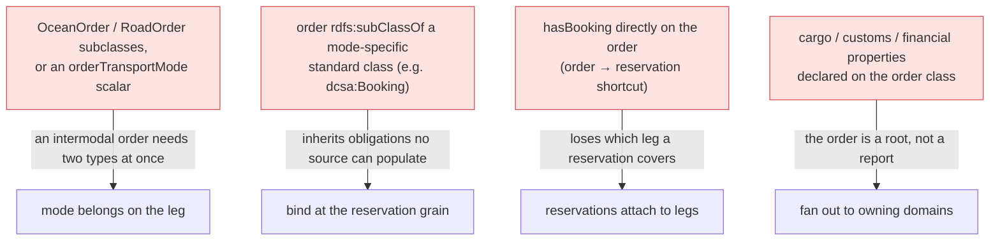

# Pattern: Multimodal order → leg

**Closes gap 5.** A transport order is multimodal by construction, but every useful standard is
mode-bound (DCSA ocean, IATA air, TAF TSI rail). The pattern attaches **mode one grain lower than
the order** — on the leg — and binds the mode-specific standard at the *reservation*, never at the
order.

## Mode binds at the reservation grain

Each leg's mode selects which standard the reservation binds to. The order itself never names a
mode — an intermodal order has none.

## Anti-patterns (rejected)

Source: [`blueprints/patterns/multimodal-order-leg`](../../../blueprints/patterns/multimodal-order-leg/pattern.md).
Naming is **normative**; participants and cardinality are advisory.
