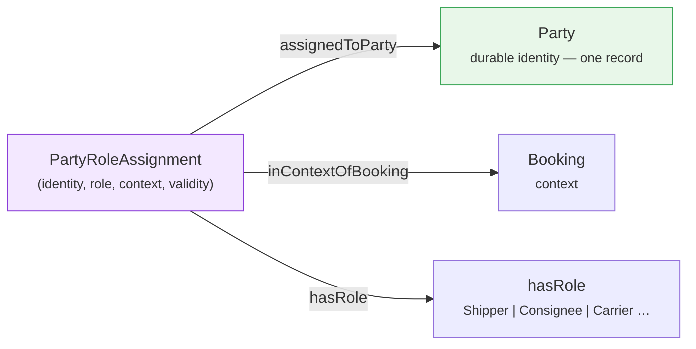
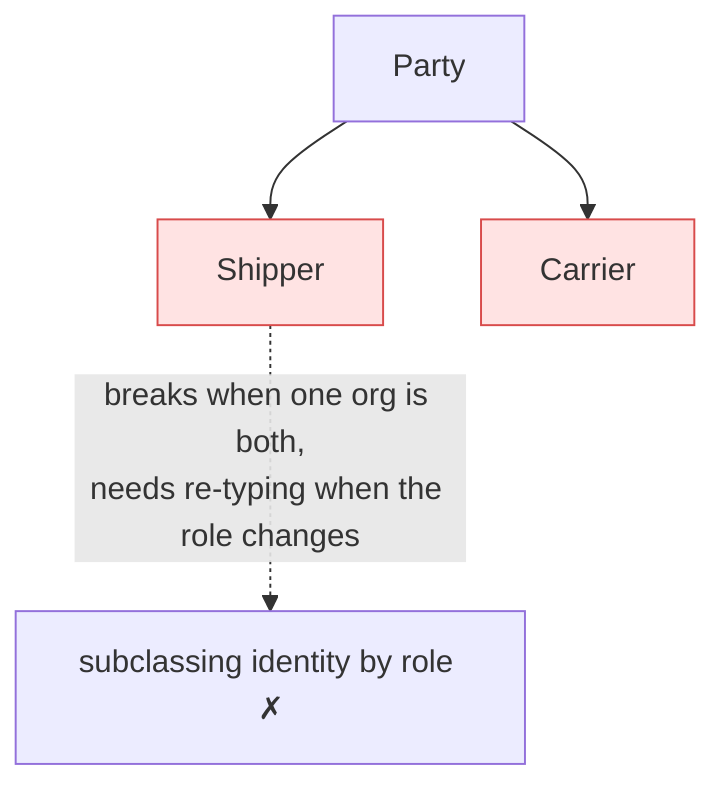

# Pattern: Qualified role assignment

**Closes gaps 1, 2, 7.** A durable identity (a party, a location) plays different roles in
different contexts over time — the same organisation is Shipper on one booking and Carrier on
another. Modelling the role *onto* the identity (`Shipper subClassOf Party`) duplicates the
identity the moment it plays two roles. Instead, reify the assignment as its own link entity.

One `Party`, many `PartyRoleAssignment`s — the same party is Shipper on one and Consignee on
another without a duplicate identity record.

## The rejected shape

Naming is **normative** (`<Identity>RoleAssignment`, `assignedTo<Identity>`, `inContextOf<Context>`,
`hasRole`). Boolean role flags (`isCarrier`) are an acceptable *physical* simplification only when
role history is not needed and they are documented as a projection of this link entity.

Source: [`blueprints/patterns/qualified-role-assignment`](../../../blueprints/patterns/qualified-role-assignment/pattern.md).
