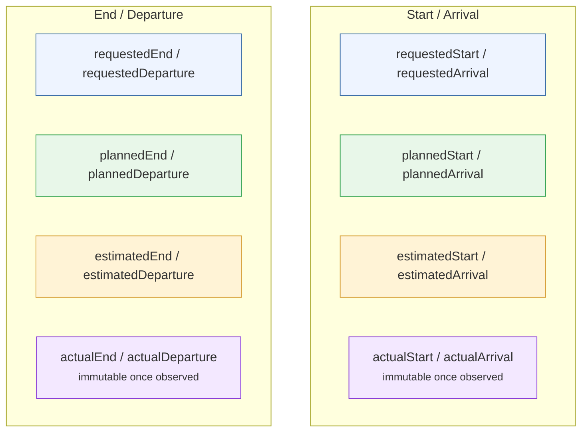
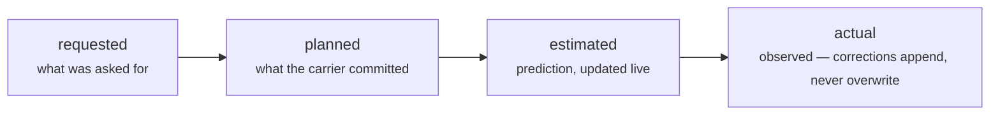

# Pattern: Temporal quartet

**Closes gap 8 (partly).** Almost every transport aggregate carries the same timestamp
distinction — **requested**, **planned**, **estimated**, **actual** — crossed with a start/arrival
and an end/departure event. Without a shared convention, each class reinvents the words for the
same eight timestamps. This pattern names them once, normatively.

## The lifecycle each qualifier captures

Use `Start`/`End` for a duration-bearing activity, `Arrival`/`Departure` for a point-of-presence
event — **never mix the two on one class**, and never substitute a synonym (`eta`, `expected`,
`due`) for `estimated`/`requested`. Most classes need only a subset; a `TransportCall` has no
"requested" leg (a carrier does not request its own port call), so only six of the eight apply.

Source: [`blueprints/patterns/temporal-quartet`](../../../blueprints/patterns/temporal-quartet/pattern.md).
Naming is **normative**; the synonym ban is the specific drift this pattern stops.
