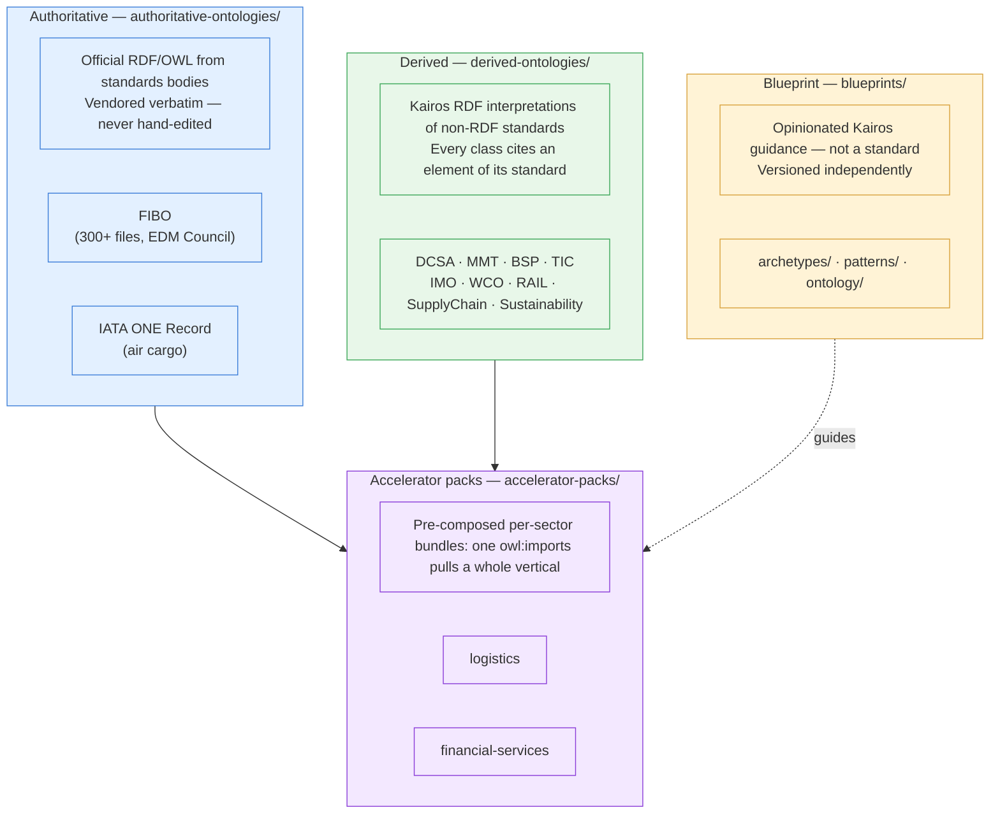

# Content tier landscape

The repository publishes three tiers of content. They differ by **who authors them** and **how
much Kairos is allowed to add** — from "vendored verbatim, never touched" to "opinionated Kairos
guidance". Accelerator packs sit on top and compose the lower tiers into per-sector bundles.

## What each tier means

| Tier | Folder | Rule of thumb |
|---|---|---|
| **Authoritative** | `authoritative-ontologies/` | Someone else's standard, already published as RDF. We vendor it **verbatim** and re-download to update — we never hand-edit it. |
| **Derived** | `derived-ontologies/` | A standard that is *not* published as RDF (DCSA APIs, TIC 4.0, WCO Data Model…). We author a faithful RDF interpretation where **every `owl:Class` cites the standard element it represents**. |
| **Blueprint** | `blueprints/` | Kairos's own opinion — archetype catalogs, reusable modelling patterns, and a handful of Kairos-authored classes for grains no standard covers. Not a standard; carries the highest bar for the last of those. |
| **Accelerator pack** | `accelerator-packs/` | A curated bundle that `owl:imports` the suites a sector needs, so a client hub imports one thing instead of nine. |
