<!-- GENERATED by scripts/generate_ontology_diagrams.py — DO NOT EDIT.
     Regenerate with: python scripts/generate_ontology_diagrams.py
     Source of truth: derived-ontologies/<suite>/current/**/*.ttl -->

# BSP — class diagram

Classes: 125 · attributes: 175 · inheritance: 68 · associations: 65

```mermaid
classDiagram
  direction LR
  class Address {
    +string city
    +string postalCode
    +string stateProvince
    +string streetAddress
  }
  class AgingBucket {
    +string agingCategory
  }
  class AirWaybill {
    +string airWaybillNumber
    +decimal chargeableWeight
    +string destinationAirport
    +string executingCarrier
    +string originAirport
  }
  class Airport {
    +string iataAirportCode
  }
  class AllocationBasis {
    +string allocationBasisType
  }
  class AncillaryRevenue
  class Bank
  class BankAccount {
    +string accountHolderName
    +string accountNumber
    +string bic
    +string iban
  }
  class BankGuarantee {
    +decimal guaranteeAmount
    +string guaranteeType
  }
  class BillOfLading {
    +string billOfLadingNumber
    +string freightPayableAt
    +boolean negotiable
    +integer numberOfOriginals
    +date onBoardDate
    +string placeOfIssue
  }
  class BudgetItem {
    +decimal budgetAmount [1..*]
    +string period
  }
  class BunkerAdjustmentFactor
  class BusinessEvent {
    +dateTime eventDateTime [1..*]
    +string eventStatus
    +string eventType
  }
  class Buyer
  class CapacityUtilization
  class Carrier
  class CertificateOfOrigin {
    +string issuingAuthority
    +string originCriterion
    +boolean preferentialIndicator
  }
  class Charge {
    +decimal chargeAmount [1..*]
    +string chargeBasis
    +string chargeType
  }
  class CommercialInvoice {
    +decimal customsValue
  }
  class CommercialTransaction {
    +string incoterm
  }
  class Consignee
  class Consignment
  class Contact {
    +string contactEmail
    +string contactName
    +string contactPhone
    +string contactRole
    +string jobTitle
  }
  class ContractRate
  class ContributionMargin {
    +decimal marginAmount
    +decimal marginPercentage
  }
  class CostAllocation {
    +decimal allocatedAmount [1..*]
  }
  class CostCenter {
    +string costCenterCode [1..*]
    +string costCenterName
  }
  class CostPerUnit {
    +string costUnit
    +decimal unitCost
  }
  class CostToServe {
    +decimal totalCostToServe
  }
  class CostVariance {
    +decimal actualAmount
    +decimal varianceAmount
    +decimal variancePercentage
  }
  class Country {
    +string countryCode
  }
  class CreditNote
  class CurrencyAdjustmentFactor
  class CustomsBroker
  class CustomsDeclaration {
    +string customsOffice
    +string declarationType
    +string procedureCode
    +date releaseDate
  }
  class CustomsEvent
  class DebitNote
  class DeliveryNote
  class Dimension
  class Document {
    +date documentDate
    +string documentNumber
    +string documentStatus
    +string documentType
    +dateTime issuingDate
    +string issuingParty
    +string signatoryName
  }
  class DocumentEvent
  class DocumentaryCollection {
    +string collectionType
  }
  class DocumentationFee
  class DutyTax {
    +decimal dutyAmount
    +string dutyCurrency
    +decimal dutyRate
    +string dutyType
  }
  class EmergencyBunkerSurcharge
  class ExportLicense
  class Facility
  class FinancingArrangement {
    +decimal discountRate
    +decimal financingAmount
    +string financingStatus
    +string financingType
  }
  class FreeTimePeriod {
    +integer freeDays
    +string freeTimeType
  }
  class FreightCharge
  class FreightForwarder
  class FreightRate {
    +decimal rateAmount [1..*]
    +string rateBasis
  }
  class FreightRevenue
  class HandlingCharge
  class HealthCertificate
  class ImportLicense
  class InspectionCertificate
  class InsuranceCertificate
  class InsuranceProvider
  class Invoice {
    +string currency
    +decimal discountAmount
    +date dueDate
    +decimal exchangeRate
    +date invoiceDate
    +string invoiceNumber [1..*]
    +decimal subtotalAmount
    +decimal taxAmount
    +decimal totalAmount
  }
  class InvoiceLine {
    +integer lineNumber [1..*]
    +decimal taxRate
  }
  class LetterOfCredit {
    +decimal creditAmount
    +date expiryDate
    +date lcIssueDate
    +string lcStatus
    +string lcType
  }
  class LoadFactor {
    +decimal capacityAvailable
    +decimal capacityUsed
    +decimal loadFactorPercentage
  }
  class Location {
    +string unLocationCode
  }
  class Manufacturer
  class ManufacturingPlant
  class Measurement
  class MonetaryAmount
  class NotifyParty
  class OrderChange {
    +string changeReason
    +string orderChangeNumber
  }
  class OrderEvent
  class OrderLine {
    +decimal lineAmount
    +integer lineNumber [1..*]
    +decimal quantity
    +string unitOfMeasure
    +decimal unitPrice
  }
  class OrderResponse {
    +date responseDate
    +string responseStatus
  }
  class OverheadAllocation
  class Package
  class PackingList
  class Payment {
    +decimal paymentAmount [1..*]
    +date paymentDate
    +string paymentMethod
    +string paymentReference
  }
  class PaymentAllocation {
    +decimal allocatedAmount
  }
  class PaymentEvent
  class PaymentTerms {
    +integer netDays
    +string paymentTermsDescription
  }
  class PeakSeasonSurcharge
  class PhytosanitaryCertificate
  class Port
  class Product {
    +string productCode
    +string productDescription
  }
  class ProfitabilityScope {
    +string scopeIdentifier
    +string scopeType
  }
  class ProformaInvoice
  class PurchaseOrder {
    +date orderDate
    +string purchaseOrderNumber [1..*]
    +date requestedDeliveryDate
  }
  class Quotation
  class RateCard {
    +decimal rateAmount
    +string rateBasis
    +date validFrom
    +date validTo
  }
  class ReceiptAdvice
  class Reconciliation
  class RegulatoryRequirement {
    +string governmentAction
    +string procedureType
    +string regulatoryAuthority
  }
  class RemittanceAdvice {
    +decimal remittanceAmount
    +date remittanceDate
    +string remittanceReference
  }
  class RequestForQuotation {
    +date rfqDate
    +string rfqNumber
    +date rfqResponseDeadline
  }
  class RevenueItem {
    +string currency
    +decimal revenueAmount [1..*]
    +string revenueCategory
  }
  class RevenuePerUnit {
    +decimal yieldPerUnit
    +string yieldUnit
  }
  class SalesContract
  class SalesOrder
  class Seller
  class Shipment {
    +date actualDeliveryDate
    +date expectedDeliveryDate
    +decimal grossWeight
    +decimal netWeight
    +integer numberOfPackages
    +string packageType
    +date shipmentDate
    +string shipmentNumber [1..*]
    +decimal volumeMeasure
  }
  class ShipmentEvent
  class ShipmentLine
  class Shipper
  class SpotRate
  class StorageCharge
  class Supplier
  class Surcharge
  class SurchargeRevenue
  class TariffClassification {
    +string hsChapter
    +string hsCode
    +string hsDescription
  }
  class TariffSchedule {
    +date validFrom
    +date validTo
  }
  class TerminalHandlingCharge
  class TerminalOperator
  class TradeAgreement {
    +date agreementEffectiveDate
    +string agreementName
    +decimal preferentialRate
  }
  class TradeItem {
    +string gtin
  }
  class TradeParty {
    +string contactEmail
    +string contactPhone
    +decimal creditLimit
    +string creditLimitCurrency
    +string dunsNumber
    +string legalEntityIdentifier
    +string partyIdentifier
    +string partyName
    +string registrationCountry
    +string registrationNumber
    +string taxIdentificationNumber
  }
  class TransportCostItem {
    +decimal costAmount [1..*]
    +string costType
    +string currency
  }
  class TransportDocument
  class TransportEquipment
  class TransportLeg
  class TransportService
  class Volume
  class Warehouse
  class WarehouseKeeper
  class Weight
  class YieldAnalysis {
    +decimal netYield
    +string period
    +decimal totalRevenue
    +decimal totalVariableCost
  }
  class rdf__Thing
  <<rdf>> rdf__Thing
  Location <|-- Address
  TransportDocument <|-- AirWaybill
  Facility <|-- Airport
  RevenueItem <|-- AncillaryRevenue
  TradeParty <|-- Bank
  TransportDocument <|-- BillOfLading
  Surcharge <|-- BunkerAdjustmentFactor
  TradeParty <|-- Buyer
  TradeParty <|-- Carrier
  Document <|-- CertificateOfOrigin
  Invoice <|-- CommercialInvoice
  TradeParty <|-- Consignee
  Shipment <|-- Consignment
  RateCard <|-- ContractRate
  Location <|-- Country
  Surcharge <|-- CurrencyAdjustmentFactor
  TradeParty <|-- CustomsBroker
  Document <|-- CustomsDeclaration
  Document <|-- DeliveryNote
  Measurement <|-- Dimension
  Charge <|-- DocumentationFee
  Surcharge <|-- EmergencyBunkerSurcharge
  Document <|-- ExportLicense
  Location <|-- Facility
  Charge <|-- FreightCharge
  TradeParty <|-- FreightForwarder
  RevenueItem <|-- FreightRevenue
  Charge <|-- HandlingCharge
  Document <|-- HealthCertificate
  Document <|-- ImportLicense
  Document <|-- InspectionCertificate
  Document <|-- InsuranceCertificate
  TradeParty <|-- InsuranceProvider
  TradeParty <|-- Manufacturer
  Facility <|-- ManufacturingPlant
  Measurement <|-- MonetaryAmount
  TradeParty <|-- NotifyParty
  CommercialTransaction <|-- OrderChange
  BusinessEvent <|-- OrderEvent
  CommercialTransaction <|-- OrderResponse
  CostAllocation <|-- OverheadAllocation
  Document <|-- PackingList
  Surcharge <|-- PeakSeasonSurcharge
  Document <|-- PhytosanitaryCertificate
  Facility <|-- Port
  Invoice <|-- ProformaInvoice
  CommercialTransaction <|-- PurchaseOrder
  CommercialTransaction <|-- Quotation
  Document <|-- ReceiptAdvice
  CommercialTransaction <|-- RequestForQuotation
  CommercialTransaction <|-- SalesContract
  CommercialTransaction <|-- SalesOrder
  TradeParty <|-- Seller
  BusinessEvent <|-- ShipmentEvent
  TradeParty <|-- Shipper
  RateCard <|-- SpotRate
  Charge <|-- StorageCharge
  TradeParty <|-- Supplier
  Charge <|-- Surcharge
  RevenueItem <|-- SurchargeRevenue
  Surcharge <|-- TerminalHandlingCharge
  TradeParty <|-- TerminalOperator
  Product <|-- TradeItem
  Document <|-- TransportDocument
  Measurement <|-- Volume
  Facility <|-- Warehouse
  TradeParty <|-- WarehouseKeeper
  Measurement <|-- Weight
  BudgetItem --> CostVariance : hasVariance
  BusinessEvent --> Location : occursAtLocation
  Charge --> TariffSchedule : appliesTariff
  Charge --> FreeTimePeriod : hasFreeTime
  CommercialTransaction --> Buyer : hasBuyer
  CommercialTransaction --> Document : hasDocument
  CommercialTransaction --> BusinessEvent : hasEvent
  CommercialTransaction --> Invoice : hasInvoice
  CommercialTransaction --> PurchaseOrder : hasPurchaseOrder
  CommercialTransaction --> Seller : hasSeller
  CommercialTransaction --> Shipment : hasShipment
  CostAllocation --> rdf__Thing : allocatedTo
  CostAllocation --> TransportCostItem : hasCostItem
  CostAllocation --> CostPerUnit : hasCostPerUnit
  CostCenter --> BudgetItem : hasBudget
  CostCenter --> CostToServe : hasCostToServe
  FreightCharge --> Surcharge : hasSurcharge
  Invoice --> Charge : hasCharge
  Invoice --> FinancingArrangement : hasFinancingArrangement
  Invoice --> InvoiceLine : hasInvoiceLine
  Invoice --> LetterOfCredit : hasLetterOfCredit
  Invoice --> Payment : hasPayment
  Invoice --> PaymentTerms : hasPaymentTerms
  Invoice --> Shipment : relatedToShipment
  LetterOfCredit --> Bank : advisingBank
  LetterOfCredit --> Bank : confirmingBank
  LetterOfCredit --> Bank : issuingBank
  OrderChange --> PurchaseOrder : amendsOrder
  OrderLine --> Product : orderedProduct
  OrderResponse --> PurchaseOrder : respondsToOrder
  OverheadAllocation --> AllocationBasis : usesAllocationBasis
  Payment --> PaymentAllocation : hasAllocation
  Payment --> RemittanceAdvice : hasRemittanceAdvice
  PaymentAllocation --> Invoice : allocatedToInvoice
  Product --> Country : hasCountryOfOrigin
  Product --> Manufacturer : hasManufacturer
  Product --> TariffClassification : hasTariffClassification
  ProfitabilityScope --> ContributionMargin : hasContributionMargin
  ProfitabilityScope --> LoadFactor : hasLoadFactor
  ProfitabilityScope --> RevenueItem : hasRevenueItem
  ProfitabilityScope --> RevenuePerUnit : hasRevenuePerUnit
  ProfitabilityScope --> YieldAnalysis : hasYieldAnalysis
  PurchaseOrder --> OrderLine : hasOrderLine
  Quotation --> RequestForQuotation : respondsToRFQ
  RevenueItem --> RateCard : appliesRateCard
  RevenuePerUnit --> ProfitabilityScope : measuredFor
  Shipment --> Carrier : hasCarrier
  Shipment --> Consignee : hasConsignee
  Shipment --> CustomsDeclaration : hasCustomsDeclaration
  Shipment --> Location : hasDestinationLocation
  Shipment --> Location : hasOriginLocation
  Shipment --> Package : hasPackage
  Shipment --> ShipmentLine : hasShipmentLine
  Shipment --> Shipper : hasShipper
  Shipment --> TransportDocument : hasTransportDocument
  Shipment --> TransportEquipment : hasTransportEquipment
  Shipment --> PurchaseOrder : relatedToOrder
  TariffSchedule --> FreightRate : hasFreightRate
  TradeParty --> Address : hasAddress
  TradeParty --> BankAccount : hasBankAccount
  TradeParty --> Address : hasBillingAddress
  TradeParty --> Contact : hasContact
  TradeParty --> PaymentTerms : hasPartyPaymentTerms
  TradeParty --> Address : hasShippingAddress
  TransportCostItem --> CostCenter : hasCostCenter
```

