<!-- GENERATED by scripts/generate_ontology_diagrams.py — DO NOT EDIT.
     Regenerate with: python scripts/generate_ontology_diagrams.py
     Source of truth: derived-ontologies/<suite>/current/**/*.ttl -->

# DCSA — class diagram

Classes: 92 · inheritance: 59 · associations: 62

```mermaid
classDiagram
  direction LR
  class AvailableForDropoffEvent
  class AvailableForPickupEvent
  class BargeTransportCall {
    +6 attributes
  }
  class BillOfLading {
    +4 attributes
  }
  class Booking {
    +12 attributes
  }
  class BookingParty
  class BookingRequest
  class BorderCrossing
  class BorderCrossingEvent
  class CargoItem {
    +5 attributes
  }
  class Carrier
  class CombinedDemurrageDetention
  class Commodity {
    +11 attributes
  }
  class ConfirmedBooking
  class Consignee
  class Container {
    +8 attributes
  }
  class ContainerFreightStation
  class ContainerJourney {
    +1 attributes
  }
  class ContainerOperationalStatus {
    +2 attributes
  }
  class ContainerStripping {
    +1 attributes
  }
  class ContainerStuffing {
    +1 attributes
  }
  class CustomsEvent {
    +1 attributes
  }
  class CutOffTime {
    +2 attributes
  }
  class DemurrageCharge {
    +5 attributes
  }
  class DemurrageDetentionTariff {
    +5 attributes
  }
  class DemurrageEvent
  class Depot
  class DepotReleaseLocation
  class DetentionCharge
  class DetentionEvent
  class DischargedFromVesselEvent
  class DisputeRecord {
    +2 attributes
  }
  class DocumentEvent
  class DocumentIssuedEvent
  class DocumentSurrenderedEvent
  class DroppedOffEvent
  class DryContainer
  class ElectronicBillOfLading
  class EmptyContainerPickupEvent
  class EmptyContainerReturnEvent
  class EquipmentEvent {
    +1 attributes
  }
  class Event {
    +5 attributes
  }
  class FlatRackContainer
  class FreeTimeAllowance {
    +2 attributes
  }
  class FreightForwarder
  class GateInEvent
  class GateOutEvent
  class InlandTerminal
  class InspectionEvent
  class LiftOnLiftOff {
    +2 attributes
  }
  class LoadedOnVesselEvent
  class Location {
    +3 attributes
  }
  class NotifyParty
  class OnwardInlandRoutingLocation
  class OpenTopContainer
  class PerDiemRate {
    +1 attributes
  }
  class PickedUpEvent
  class PlaceOfDelivery
  class PlaceOfReceipt
  class PlatformContainer
  class Port
  class PortOfDischarge
  class PortOfLoading
  class PreCarriageFromLocation
  class RailRamp
  class RailTransportCall {
    +3 attributes
  }
  class RateTier {
    +3 attributes
  }
  class ReeferContainer {
    +4 attributes
  }
  class RequestedEquipment
  class SailingSchedule
  class SeaWaybill
  class SealEvent {
    +1 attributes
  }
  class ServiceLoop {
    +2 attributes
  }
  class Shipment {
    +4 attributes
  }
  class Shipper
  class ShippingInstruction {
    +1 attributes
  }
  class ShippingParty
  class StorageCharge
  class TankContainer
  class Terminal {
    +1 attributes
  }
  class TransitTime {
    +2 attributes
  }
  class TransportCall {
    +5 attributes
  }
  class TransportDocument {
    +5 attributes
  }
  class TransportEvent
  class TransportPlanLeg {
    +5 attributes
  }
  class TransshipmentPort
  class TruckTransportCall {
    +2 attributes
  }
  class UtilizedTransportEquipment {
    +1 attributes
  }
  class VesselArrivalEvent {
    +2 attributes
  }
  class VesselDepartureEvent {
    +2 attributes
  }
  class VesselTransportCall {
    +2 attributes
  }
  class Waiver {
    +2 attributes
  }
  EquipmentEvent <|-- AvailableForDropoffEvent
  EquipmentEvent <|-- AvailableForPickupEvent
  TransportCall <|-- BargeTransportCall
  TransportDocument <|-- BillOfLading
  ShippingParty <|-- BookingParty
  Booking <|-- BookingRequest
  Location <|-- BorderCrossing
  EquipmentEvent <|-- BorderCrossingEvent
  ShippingParty <|-- Carrier
  DemurrageCharge <|-- CombinedDemurrageDetention
  DetentionCharge <|-- CombinedDemurrageDetention
  Booking <|-- ConfirmedBooking
  ShippingParty <|-- Consignee
  Location <|-- ContainerFreightStation
  EquipmentEvent <|-- CustomsEvent
  Location <|-- Depot
  Location <|-- DepotReleaseLocation
  EquipmentEvent <|-- DischargedFromVesselEvent
  Event <|-- DocumentEvent
  DocumentEvent <|-- DocumentIssuedEvent
  DocumentEvent <|-- DocumentSurrenderedEvent
  EquipmentEvent <|-- DroppedOffEvent
  Container <|-- DryContainer
  BillOfLading <|-- ElectronicBillOfLading
  EquipmentEvent <|-- EmptyContainerPickupEvent
  EquipmentEvent <|-- EmptyContainerReturnEvent
  Event <|-- EquipmentEvent
  Container <|-- FlatRackContainer
  ShippingParty <|-- FreightForwarder
  EquipmentEvent <|-- GateInEvent
  EquipmentEvent <|-- GateOutEvent
  Location <|-- InlandTerminal
  EquipmentEvent <|-- InspectionEvent
  EquipmentEvent <|-- LoadedOnVesselEvent
  ShippingParty <|-- NotifyParty
  Location <|-- OnwardInlandRoutingLocation
  Container <|-- OpenTopContainer
  EquipmentEvent <|-- PickedUpEvent
  Location <|-- PlaceOfDelivery
  Location <|-- PlaceOfReceipt
  Container <|-- PlatformContainer
  Location <|-- Port
  Port <|-- PortOfDischarge
  Port <|-- PortOfLoading
  Location <|-- PreCarriageFromLocation
  Location <|-- RailRamp
  TransportCall <|-- RailTransportCall
  Container <|-- ReeferContainer
  TransportDocument <|-- SeaWaybill
  EquipmentEvent <|-- SealEvent
  ShippingParty <|-- Shipper
  Container <|-- TankContainer
  Location <|-- Terminal
  Event <|-- TransportEvent
  Port <|-- TransshipmentPort
  TransportCall <|-- TruckTransportCall
  TransportEvent <|-- VesselArrivalEvent
  TransportEvent <|-- VesselDepartureEvent
  TransportCall <|-- VesselTransportCall
  Booking --> BookingParty : hasBookingParty
  Booking --> CargoItem : hasCargoItem
  Booking --> Location : hasLocation
  Booking --> ShippingParty : hasParty
  Booking --> PlaceOfDelivery : hasPlaceOfDelivery
  Booking --> PlaceOfReceipt : hasPlaceOfReceipt
  Booking --> PortOfDischarge : hasPortOfDischarge
  Booking --> PortOfLoading : hasPortOfLoading
  Booking --> RequestedEquipment : hasRequestedEquipment
  Booking --> ShippingInstruction : hasShippingInstruction
  Booking --> TransshipmentPort : hasTransshipmentPort
  CargoItem --> Commodity : hasCommodity
  ConfirmedBooking --> TransportPlanLeg : hasTransportPlan
  Container --> ContainerJourney : hasContainerJourney
  ContainerJourney --> LiftOnLiftOff : hasLoLoOperation
  ContainerJourney --> ContainerOperationalStatus : hasOperationalStatus
  ContainerJourney --> ContainerStripping : hasStrippingOperation
  ContainerJourney --> ContainerStuffing : hasStuffingOperation
  ContainerStuffing --> Location : atLocation
  ContainerStuffing --> EquipmentEvent : triggeredByEvent
  DemurrageCharge --> DemurrageDetentionTariff : appliesTariff
  DemurrageCharge --> Location : chargedAtFacility
  DemurrageCharge --> Container : chargedForContainer
  DemurrageCharge --> ShippingParty : chargedToParty
  DemurrageCharge --> DisputeRecord : hasDispute
  DemurrageCharge --> DemurrageEvent : stoppedBy
  DemurrageCharge --> DemurrageEvent : triggeredBy
  DemurrageDetentionTariff --> FreeTimeAllowance : hasFreeTimeAllowance
  DemurrageDetentionTariff --> PerDiemRate : hasPerDiemRate
  DisputeRecord --> Waiver : hasWaiver
  EquipmentEvent --> Container : involvesContainer
  Event --> TransportCall : hasTransportCall
  Event --> Location : occursAtLocation
  PerDiemRate --> RateTier : hasRateTier
  SailingSchedule --> CutOffTime : hasCutOffTime
  SailingSchedule --> Port : hasPortOfCall
  SailingSchedule --> ServiceLoop : hasServiceLoop
  SailingSchedule --> VesselTransportCall : hasTransportCall
  ServiceLoop --> TransitTime : hasTransitTime
  Shipment --> Booking : hasBooking
  Shipment --> Carrier : hasCarrier
  Shipment --> Consignee : hasConsignee
  Shipment --> Event : hasEvent
  Shipment --> NotifyParty : hasNotifyParty
  Shipment --> ShippingParty : hasParty
  Shipment --> Shipper : hasShipper
  Shipment --> TransportDocument : hasTransportDocument
  Shipment --> UtilizedTransportEquipment : hasUtilizedEquipment
  TransportCall --> Location : occursAtFacility
  TransportDocument --> Consignee : hasDocumentConsignee
  TransportDocument --> Location : hasDocumentLocation
  TransportDocument --> NotifyParty : hasDocumentNotifyParty
  TransportDocument --> ShippingParty : hasDocumentParty
  TransportDocument --> Shipper : hasDocumentShipper
  TransportDocument --> PlaceOfDelivery : hasPlaceOfDelivery
  TransportDocument --> PlaceOfReceipt : hasPlaceOfReceipt
  TransportDocument --> PortOfDischarge : hasPortOfDischarge
  TransportDocument --> PortOfLoading : hasPortOfLoading
  TransportPlanLeg --> Location : hasDischargeLocation
  TransportPlanLeg --> Location : hasLoadLocation
  TransportPlanLeg --> TransportCall : legHasTransportCall
  UtilizedTransportEquipment --> Container : hasContainer
```

