<!-- GENERATED by scripts/generate_ontology_diagrams.py — DO NOT EDIT.
     Regenerate with: python scripts/generate_ontology_diagrams.py
     Source of truth: derived-ontologies/<suite>/current/**/*.ttl -->

# IMO — class diagram

Classes: 89 · attributes: 142 · inheritance: 32 · associations: 73

```mermaid
classDiagram
  direction LR
  class Anchorage {
    +string anchorageName
  }
  class ArrivalNotice
  class BallastWaterManagementPlan {
    +string bwmsTreatmentType
    +date planApprovalDate [1..*]
    +date planRevisionDate
  }
  class Berth {
    +decimal berthLength
    +string berthName [1..*]
    +decimal depthAlongside
  }
  class BerthStay {
    +dateTime berthArrivalTime
    +dateTime berthDepartureTime
  }
  class BunkeringOperation {
    +decimal bunkerQuantity
  }
  class CallSign
  class CertificateOfCompetency {
    +date cocExpiryDate
    +string cocGrade
    +date cocIssueDate
    +string cocIssuingCountry
    +string cocNumber [1]
  }
  class CertificateOfProficiency {
    +string copFunction
  }
  class ClassSociety
  class ClassificationSociety
  class CompanySecurityOfficer
  class CrewChange {
    +integer crewMemberCount
  }
  class CrewList {
    +date listDate
    +integer totalCrewCount
  }
  class CrewMember {
    +date embarkationDate
    +string portOfEmbarkation
    +string rank
  }
  class DGDeclaration {
    +date declarationDate
  }
  class DangerousGoodsItem {
    +string properShippingName
    +string subsidiaryRisk
  }
  class DeadweightTonnage {
    +decimal deadweightTonnageValue
  }
  class DeclarationOfSecurity {
    +string dosActivityDescription
    +dateTime dosEndDate
    +dateTime dosStartDate
    +integer securityLevel
  }
  class DepartureNotice
  class DocumentOfCompliance
  class EmergencyContact {
    +string contactName
    +string contactPhone
  }
  class EmergencySchedule {
    +string emsFireSchedule
    +string emsSpillageSchedule
  }
  class EmissionControlArea {
    +string ecaDesignation [1..*]
    +string ecaName
  }
  class FALForm {
    +integer falFormNumber
    +string falFormType
  }
  class FlagAuthority {
    +string authorityCountryCode [1..*]
  }
  class FlagState
  class FlashPoint {
    +decimal flashPointValue
  }
  class Fleet
  class GarbageManagementPlan {
    +date planApprovalDate
    +date planRevisionDate
  }
  class GrossTonnage {
    +decimal grossTonnageValue
  }
  class HazardClass {
    +string hazardClassCode
  }
  class IMONumber
  class InternationalEnergyEfficiencyCertificate {
    +decimal attainedEEDI
    +decimal attainedEEXI
    +string ciiRating
    +decimal ciiValue
    +decimal requiredEEDI
    +decimal requiredEEXI
  }
  class InternationalShipSecurityCertificate
  class MARPOLSpecialArea {
    +string specialAreaAnnex
    +string specialAreaName
  }
  class MMSI
  class MaritimeAgent
  class MaritimeLabourCertificate {
    +string dmlcPartI
    +string dmlcPartII
  }
  class MaritimeLocation {
    +decimal latitude
    +decimal longitude
    +decimal maxDraftAllowed
  }
  class MaritimeParty {
    +string contactEmail
    +string contactPhone
    +string imoCompanyNumber
    +string partyIdentifier
    +string partyName
    +string portOfOperation
  }
  class MasterOfVessel {
    +string certificateOfCompetency [1..*]
  }
  class NetTonnage {
    +decimal netTonnageValue
  }
  class NoxiousLiquidSubstance {
    +string nlsCategory [1]
    +string nlsName
  }
  class PackingGroup {
    +string packingGroupCode
  }
  class Passenger {
    +string passengerDisembarkedAt
    +string passengerEmbarkedAt
    +string passengerName
    +string passengerNationality
  }
  class PassengerList {
    +date listDate
    +integer totalPassengerCount
  }
  class PilotBoardingPlace
  class PilotService
  class PilotageRequest {
    +dateTime requestedTime [1..*]
  }
  class Port {
    +string portName
    +string unlocode [1]
  }
  class PortApproach {
    +decimal channelDepth
    +decimal channelWidth
  }
  class PortAuthority
  class PortCall {
    +dateTime actualTimeOfArrival
    +dateTime actualTimeOfDeparture
    +dateTime estimatedTimeOfArrival
    +dateTime estimatedTimeOfDeparture
  }
  class PortCallStatus
  class PortFacilitySecurityOfficer
  class PortFacilitySecurityPlan {
    +date approvalDate [1..*]
    +string ispsComplianceStatus
    +date reviewDueDate
    +string rsoName
    +integer securityLevel
  }
  class PortHealthDeclaration {
    +date healthDeclarationDate
    +boolean healthIssuesReported
  }
  class PortReceptionFacility {
    +string wasteTypesAccepted
  }
  class PortStateControlOfficer
  class PreArrivalNotification {
    +string preArrivalStatus
    +dateTime preArrivalSubmittedDate
  }
  class RouteWaypoint {
    +decimal plannedSpeed
    +decimal waypointLatitude
    +decimal waypointLongitude
    +integer waypointSequence
  }
  class SafetyManagementCertificate
  class SeaLeg
  class Seafarer {
    +date dateOfBirth
    +string nationality
    +string seafarerId [1..*]
    +string seafarerName
  }
  class SegregationRule
  class ShipEnergyEfficiencyManagementPlan {
    +date planApprovalDate [1..*]
    +date planRevisionDate
    +string seemPartIIIStatus
    +string seemPartIIStatus
    +string seemPartIStatus
  }
  class ShipManager
  class ShipOperator
  class ShipOwner
  class ShipSecurityOfficer
  class ShipSecurityPlan {
    +date approvalDate [1..*]
    +string ispsComplianceStatus
    +date reviewDueDate
    +string rsoName
    +integer securityLevel
  }
  class ShipboardOilPollutionEmergencyPlan {
    +date planApprovalDate
    +date planRevisionDate
  }
  class StatutoryCertificate {
    +string certificateNumber [1]
    +string certificateType [1]
    +date expiryDate
    +date issueDate
    +string issuingAuthority
    +date lastEndorsementDate
  }
  class StatutorySurvey {
    +string surveyConvention
    +date surveyDate [1]
    +string surveyOutcome
    +string surveyType
  }
  class StowageCategory
  class TowageProvider
  class TowageRequest {
    +dateTime requestedTime
  }
  class TrafficSeparationScheme
  class UNNumber {
    +string unNumberValue
  }
  class VTSZone {
    +string vtsAuthority [1..*]
    +string vtsChannel
  }
  class Vessel {
    +decimal beamValue
    +string callSignValue
    +decimal draftValue
    +string imoNumber [1]
    +decimal lengthOverallValue
    +string mmsiNumber
    +string portOfRegistry
    +string vesselName
    +gYear yearBuilt
  }
  class VesselCapacity
  class VesselOperationalStatus
  class VesselType
  class Voyage {
    +string voyageNumber [1..*]
  }
  class VoyagePlan {
    +dateTime voyagePlanApprovalDate
  }
  class WasteDisposal {
    +decimal wasteQuantity
    +string wasteType
  }
  class WastePreNotification {
    +decimal estimatedWasteVolume
    +dateTime wasteNotificationDate
  }
  class imo__PortFacility
  <<imo>> imo__PortFacility
  MaritimeLocation <|-- Anchorage
  MaritimeLocation <|-- Berth
  MaritimeParty <|-- ClassificationSociety
  MaritimeParty <|-- CompanySecurityOfficer
  VesselCapacity <|-- DeadweightTonnage
  StatutoryCertificate <|-- DocumentOfCompliance
  MaritimeLocation <|-- EmissionControlArea
  MaritimeParty <|-- FlagAuthority
  VesselCapacity <|-- GrossTonnage
  StatutoryCertificate <|-- InternationalEnergyEfficiencyCertificate
  StatutoryCertificate <|-- InternationalShipSecurityCertificate
  MaritimeLocation <|-- MARPOLSpecialArea
  MaritimeParty <|-- MaritimeAgent
  StatutoryCertificate <|-- MaritimeLabourCertificate
  MaritimeParty <|-- MasterOfVessel
  VesselCapacity <|-- NetTonnage
  MaritimeLocation <|-- PilotBoardingPlace
  MaritimeParty <|-- PilotService
  MaritimeLocation <|-- Port
  MaritimeLocation <|-- PortApproach
  MaritimeParty <|-- PortAuthority
  MaritimeParty <|-- PortFacilitySecurityOfficer
  MaritimeLocation <|-- PortReceptionFacility
  MaritimeParty <|-- PortStateControlOfficer
  StatutoryCertificate <|-- SafetyManagementCertificate
  MaritimeParty <|-- ShipManager
  MaritimeParty <|-- ShipOperator
  MaritimeParty <|-- ShipOwner
  MaritimeParty <|-- ShipSecurityOfficer
  MaritimeParty <|-- TowageProvider
  MaritimeLocation <|-- TrafficSeparationScheme
  MaritimeLocation <|-- VTSZone
  BallastWaterManagementPlan --> Vessel : appliesToVessel
  ClassificationSociety --> FlagAuthority : recognizedBy
  CrewList --> PortCall : forPortCall
  CrewList --> Vessel : forVessel
  CrewList --> "1..*" CrewMember : hasCrewMember
  CrewMember --> "1" Seafarer : hasSeafarer
  DGDeclaration --> "1..*" DangerousGoodsItem : declaresItem
  DGDeclaration --> EmergencyContact : hasEmergencyContact
  DangerousGoodsItem --> EmergencySchedule : hasEmergencySchedule
  DangerousGoodsItem --> FlashPoint : hasFlashPoint
  DangerousGoodsItem --> "1..*" HazardClass : hasHazardClass
  DangerousGoodsItem --> PackingGroup : hasPackingGroup
  DangerousGoodsItem --> StowageCategory : hasStowageCategory
  DangerousGoodsItem --> "1..*" UNNumber : hasUNNumber
  DeclarationOfSecurity --> imo__PortFacility : dosFacility
  DeclarationOfSecurity --> Vessel : dosShip
  DocumentOfCompliance --> MaritimeParty : issuedToCompany
  Fleet --> Vessel : hasMember
  GarbageManagementPlan --> Vessel : appliesToVessel
  HazardClass --> SegregationRule : hasSegregationRule
  MaritimeLocation --> MaritimeLocation : locatedWithin
  MaritimeParty --> MaritimeParty : actsOnBehalfOf
  MaritimeParty --> MasterOfVessel : employs
  MaritimeParty --> MaritimeLocation : providesServiceAt
  PassengerList --> PortCall : forPortCall
  PassengerList --> Vessel : forVessel
  PassengerList --> Passenger : hasPassenger
  Port --> Anchorage : hasAnchorage
  Port --> Berth : hasBerth
  Port --> PilotBoardingPlace : hasPilotBoardingPlace
  Port --> PortApproach : hasPortApproach
  Port --> VTSZone : hasVTSZone
  PortApproach --> TrafficSeparationScheme : hasTrafficSeparationScheme
  PortCall --> ArrivalNotice : hasArrivalNotice
  PortCall --> BerthStay : hasBerthStay
  PortCall --> BunkeringOperation : hasBunkeringOperation
  PortCall --> CrewChange : hasCrewChange
  PortCall --> DepartureNotice : hasDepartureNotice
  PortCall --> FALForm : hasFALForm
  PortCall --> PilotageRequest : hasPilotageRequest
  PortCall --> "1..*" PortCallStatus : hasPortCallStatus
  PortCall --> PortHealthDeclaration : hasPortHealthDeclaration
  PortCall --> PreArrivalNotification : hasPreArrivalNotification
  PortCall --> TowageRequest : hasTowageRequest
  PortCall --> WasteDisposal : hasWasteDisposal
  PortCall --> WastePreNotification : hasWastePreNotification
  PortCall --> Voyage : partOfVoyage
  PortFacilitySecurityPlan --> imo__PortFacility : appliesToFacility
  SeaLeg --> Voyage : partOfVoyage
  Seafarer --> CertificateOfCompetency : holdsCoC
  Seafarer --> CertificateOfProficiency : holdsCoP
  ShipEnergyEfficiencyManagementPlan --> Vessel : appliesToVessel
  ShipManager --> ShipOwner : managesVesselFor
  ShipOperator --> ShipOwner : operatesVesselFor
  ShipSecurityPlan --> Vessel : appliesToVessel
  ShipboardOilPollutionEmergencyPlan --> Vessel : appliesToVessel
  StatutoryCertificate --> MaritimeParty : issuedBy
  StatutoryCertificate --> Vessel : issuedFor
  StatutoryCertificate --> StatutorySurvey : resultOfSurvey
  StatutorySurvey --> MaritimeParty : conductedBy
  StatutorySurvey --> Vessel : surveyedVessel
  Vessel --> CallSign : hasCallSign
  Vessel --> VesselCapacity : hasCapacity
  Vessel --> ClassSociety : hasClassSociety
  Vessel --> "1" FlagState : hasFlagState
  Vessel --> IMONumber : hasIMONumber
  Vessel --> MMSI : hasMMSI
  Vessel --> VesselOperationalStatus : hasOperationalStatus
  Vessel --> "1..*" VesselType : hasVesselType
  Voyage --> PortCall : hasPortCall
  Voyage --> SeaLeg : hasSeaLeg
  Voyage --> VoyagePlan : hasVoyagePlan
  VoyagePlan --> "2..*" RouteWaypoint : hasWaypoint
```

