<!-- GENERATED by scripts/generate_ontology_diagrams.py — DO NOT EDIT.
     Regenerate with: python scripts/generate_ontology_diagrams.py
     Source of truth: derived-ontologies/<suite>/current/**/*.ttl -->

# MMT — class diagram

Classes: 110 · attributes: 95 · inheritance: 62 · associations: 46

```mermaid
classDiagram
  direction LR
  class AirWaybill {
    +string airWaybillNumber
  }
  class Aircraft {
    +string flightNumber
  }
  class Airport {
    +string iataAirportCode
    +string icaoAirportCode
  }
  class ArrivalEvent
  class BargeLeg
  class BargeVessel
  class BillOfLading {
    +string billOfLadingNumber
  }
  class BorderCrossing
  class CargoInsurance
  class CargoItem {
    +string cargoDescription
  }
  class CargoManifest
  class CargoMeasurement
  class Carrier
  class CertificateOfOrigin
  class CommercialInvoice
  class Commodity {
    +string commodityCode
    +string commodityDescription
  }
  class Consignee
  class Consignment {
    +dateTime availabilityDueDateTime
    +dateTime carrierAcceptanceDateTime
    +string carrierAssignedID
    +decimal chargeableWeight
    +string consigneeAssignedID
    +string consignmentReference [1..*]
    +string consignorAssignedID
    +boolean containerizationIndicator
    +string currency
    +string customsID
    +decimal customsValue
    +dateTime exportExitDateTime
    +string freightForwarderAssignedID
    +string freightTerms
    +string incoterm
    +integer loadingSequenceNumeric
    +boolean transshipmentPermissionIndicator
  }
  class ConsignmentItem {
    +decimal grossWeight
    +integer itemSequenceNumber [1..*]
    +decimal netWeight
    +integer numberOfPackages
    +decimal volume
  }
  class Consignor
  class CorrosiveSubstance
  class CustomsBroker
  class CustomsClearanceEvent
  class CustomsDeclaration
  class DangerousGoods {
    +string emergencyContactNumber
    +decimal flashPoint
    +string hazardClass
    +string packingGroup
    +string properShippingName
    +string technicalName
    +string unNumber
  }
  class DangerousGoodsDeclaration
  class DeliveryEvent
  class DeliveryInstructions
  class DepartureEvent
  class Dimension {
    +string dimensionUnit
    +decimal heightValue
    +decimal lengthValue
    +decimal widthValue
  }
  class DischargeEvent
  class DisposalInstructions
  class DistributionCenter
  class DocumentAuthentication
  class DocumentVersion
  class ExplosiveGoods
  class FlammableGas
  class FlammableLiquid
  class FlammableSolid
  class FreightContainer
  class FreightForwarder
  class Goods
  class GoodsItem {
    +string countryOfOrigin
    +string goodsDescription
    +string hsCode
    +boolean isHazardous
  }
  class HandlingInstructions {
    +string handlingCode
    +string handlingInstruction
  }
  class HandoverEvent {
    +dateTime handoverDateTime
    +string handoverType
  }
  class HaulageInstructions
  class HouseConsignment {
    +string houseReferenceNumber
  }
  class HouseWaybill
  class InlandCarrier {
    +string inlandCarrierCode
  }
  class InlandLeg {
    +string inlandMode
  }
  class InlandPort
  class InlandTerminal {
    +string terminalCode
  }
  class InspectionEvent
  class InspectionStatus
  class LoadingEvent
  class Location {
    +string unLocationCode
  }
  class LogisticsConvoy
  class LogisticsMeansOfTransport {
    +string carrierCode
  }
  class MasterConsignment {
    +string masterReferenceNumber
  }
  class MasterWaybill
  class MiscellaneousDangerousGoods
  class NotifyParty
  class OxidizingSubstance
  class Package {
    +string packageCode
    +string packageType
  }
  class PackageSpecification
  class PackingList
  class Pallet
  class PickupEvent
  class Port
  class ProductCertificate
  class QuarantineInstructions
  class RadioactiveMaterial
  class RailConsignmentNote
  class RailLeg
  class RailTerminal
  class RailVehicle {
    +string trainNumber
  }
  class ReeferContainer {
    +decimal maximumTemperature
    +decimal minimumTemperature
    +decimal temperatureSetting
  }
  class RoadConsignmentNote
  class RoadLeg
  class RoadTerminal
  class RoadVehicle {
    +string vehicleRegistration
  }
  class Route {
    +string frequencyTypeCode
    +string routeCode
    +string routeDescription
    +string securityLevelCode
    +string statusCode
  }
  class Seal {
    +string sealNumber
    +string sealType
  }
  class ShippingMarks
  class SwapBody
  class TankContainer
  class TemperatureSettingInstructions
  class Terminal
  class TerminalOperator
  class ToxicSubstance
  class TrailerUnit
  class TransferEvent
  class TransportDocument {
    +string documentNumber [1..*]
  }
  class TransportEquipment {
    +string categoryCode
    +string equipmentIdentifier [1..*]
    +string equipmentSizeType
    +boolean isShipperOwned
    +decimal maxGrossWeight
    +string operationalStatusCode
    +decimal tareWeight
    +string transportMovementStatusCode
  }
  class TransportEvent {
    +dateTime eventDateTime [1..*]
    +string eventStatus
    +string eventType
  }
  class TransportInstructions
  class TransportLeg
  class TransportLocation
  class TransportMovement {
    +dateTime actualArrivalTime
    +dateTime actualDepartureTime
    +dateTime estimatedArrivalTime
    +dateTime estimatedDepartureTime
    +string modeCode
    +string movementStatusCode
    +string stageCode
    +string transportMode
  }
  class TransportParty
  class TransportRoute
  class TransportService
  class TransportServiceExecution
  class Vessel {
    +string vesselIMO
    +string vesselName
    +string voyageNumber
  }
  class Warehouse
  class WarehouseOperator
  class WarehouseStorageEvent
  class WasteMaterial
  class WasteMaterialComponent
  class Weight {
    +string weightUnit
    +decimal weightValue
  }
  TransportDocument <|-- AirWaybill
  LogisticsMeansOfTransport <|-- Aircraft
  TransportLocation <|-- Airport
  TransportEvent <|-- ArrivalEvent
  InlandLeg <|-- BargeLeg
  Vessel <|-- BargeVessel
  TransportDocument <|-- BillOfLading
  TransportLocation <|-- BorderCrossing
  TransportDocument <|-- CargoManifest
  TransportParty <|-- Carrier
  TransportParty <|-- Consignee
  TransportParty <|-- Consignor
  DangerousGoods <|-- CorrosiveSubstance
  TransportParty <|-- CustomsBroker
  TransportEvent <|-- CustomsClearanceEvent
  TransportEvent <|-- DeliveryEvent
  TransportEvent <|-- DepartureEvent
  TransportEvent <|-- DischargeEvent
  Warehouse <|-- DistributionCenter
  DangerousGoods <|-- ExplosiveGoods
  DangerousGoods <|-- FlammableGas
  DangerousGoods <|-- FlammableLiquid
  DangerousGoods <|-- FlammableSolid
  TransportEquipment <|-- FreightContainer
  TransportParty <|-- FreightForwarder
  Consignment <|-- HouseConsignment
  TransportDocument <|-- HouseWaybill
  TransportLocation <|-- InlandPort
  TransportEvent <|-- InspectionEvent
  TransportEvent <|-- LoadingEvent
  Consignment <|-- MasterConsignment
  TransportDocument <|-- MasterWaybill
  DangerousGoods <|-- MiscellaneousDangerousGoods
  TransportParty <|-- NotifyParty
  DangerousGoods <|-- OxidizingSubstance
  TransportEquipment <|-- Pallet
  TransportEvent <|-- PickupEvent
  TransportLocation <|-- Port
  TransportDocument <|-- ProductCertificate
  DangerousGoods <|-- RadioactiveMaterial
  TransportDocument <|-- RailConsignmentNote
  InlandLeg <|-- RailLeg
  TransportLocation <|-- RailTerminal
  LogisticsMeansOfTransport <|-- RailVehicle
  FreightContainer <|-- ReeferContainer
  TransportDocument <|-- RoadConsignmentNote
  InlandLeg <|-- RoadLeg
  TransportLocation <|-- RoadTerminal
  LogisticsMeansOfTransport <|-- RoadVehicle
  TransportEquipment <|-- SwapBody
  FreightContainer <|-- TankContainer
  TransportLocation <|-- Terminal
  TransportParty <|-- TerminalOperator
  DangerousGoods <|-- ToxicSubstance
  TransportEquipment <|-- TrailerUnit
  TransportEvent <|-- TransferEvent
  Location <|-- TransportLocation
  TransportService <|-- TransportServiceExecution
  LogisticsMeansOfTransport <|-- Vessel
  Location <|-- Warehouse
  TransportParty <|-- WarehouseOperator
  TransportEvent <|-- WarehouseStorageEvent
  CargoItem --> Commodity : hasCommodity
  CargoItem --> Dimension : hasDimension
  CargoItem --> HandlingInstructions : hasHandlingInstructions
  CargoItem --> HandlingInstructions : hasHandlingRequirement
  CargoItem --> CargoInsurance : hasInsurance
  CargoItem --> CargoMeasurement : hasMeasurement
  CargoItem --> PackageSpecification : hasPackageSpecification
  CargoItem --> ShippingMarks : hasShippingMarks
  CargoItem --> Weight : hasWeight
  Consignment --> Carrier : hasCarrier
  Consignment --> Consignee : hasConsignee
  Consignment --> ConsignmentItem : hasConsignmentItem
  Consignment --> Consignor : hasConsignor
  Consignment --> CustomsDeclaration : hasCustomsDeclaration
  Consignment --> DangerousGoods : hasDangerousGoods
  Consignment --> TransportEvent : hasEvent
  Consignment --> FreightForwarder : hasFreightForwarder
  Consignment --> NotifyParty : hasNotifyParty
  Consignment --> TransportParty : hasParty
  Consignment --> TransportDocument : hasTransportDocument
  Consignment --> TransportEquipment : hasTransportEquipment
  ConsignmentItem --> GoodsItem : containsGoods
  GoodsItem --> Package : hasPackage
  GoodsItem --> TransportEquipment : loadedInEquipment
  InlandLeg --> InlandTerminal : hasDestinationTerminal
  InlandLeg --> HandoverEvent : hasHandoverEvent
  InlandLeg --> InlandTerminal : hasOriginTerminal
  InlandLeg --> InlandCarrier : operatedBy
  LogisticsConvoy --> LogisticsMeansOfTransport : hasConvoyMember
  MasterConsignment --> HouseConsignment : hasHouseConsignment
  Route --> TransportEvent : hasItineraryStop
  TransportDocument --> DocumentAuthentication : hasAuthentication
  TransportDocument --> ProductCertificate : hasCertificate
  TransportDocument --> DocumentVersion : hasVersion
  TransportEquipment --> Seal : hasSeal
  TransportEquipment --> TemperatureSettingInstructions : hasTemperatureInstructions
  TransportEvent --> TransportEquipment : involvesEquipment
  TransportEvent --> LogisticsMeansOfTransport : involvesTransportMeans
  TransportEvent --> Location : occursAtLocation
  TransportLeg --> "1..*" TransportLocation : arrivalLocation
  TransportLeg --> "1..*" TransportLocation : departureLocation
  TransportLeg --> TransportLocation : hasLocation
  TransportLeg --> LogisticsMeansOfTransport : usesTransportMeans
  TransportRoute --> TransportLeg : hasTransportLeg
  TransportService --> Consignment : hasConsignment
  TransportService --> TransportRoute : hasRoute
```

