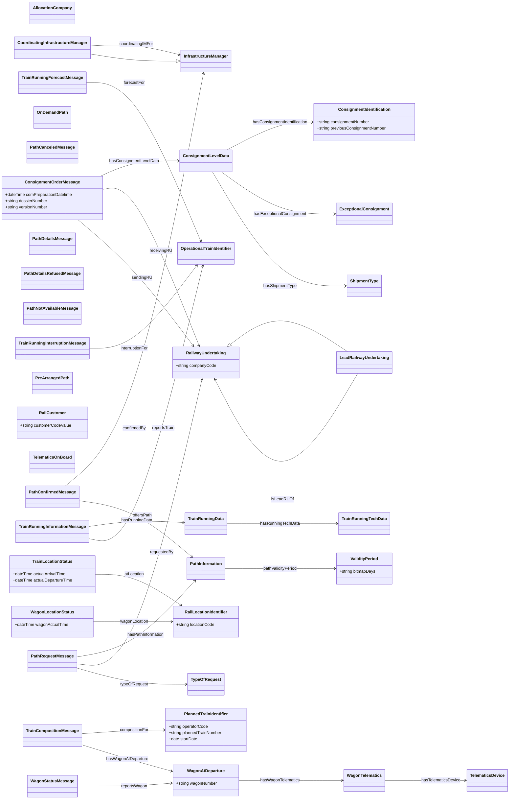

<!-- GENERATED by scripts/generate_ontology_diagrams.py — DO NOT EDIT.
     Regenerate with: python scripts/generate_ontology_diagrams.py
     Source of truth: derived-ontologies/<suite>/current/**/*.ttl -->

# RAIL — class diagram

Classes: 38 · attributes: 16 · inheritance: 2 · associations: 26

