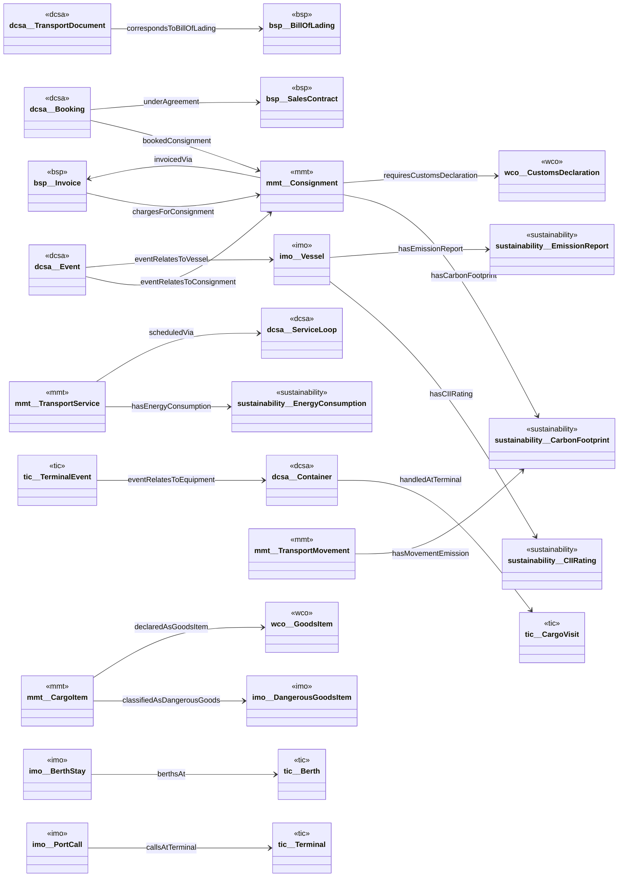

<!-- GENERATED by scripts/generate_ontology_diagrams.py — DO NOT EDIT.
     Regenerate with: python scripts/generate_ontology_diagrams.py
     Source of truth: derived-ontologies/<suite>/current/**/*.ttl -->

# SupplyChain — class diagram

Classes: 0 · attributes: 0 · inheritance: 0 · associations: 20

